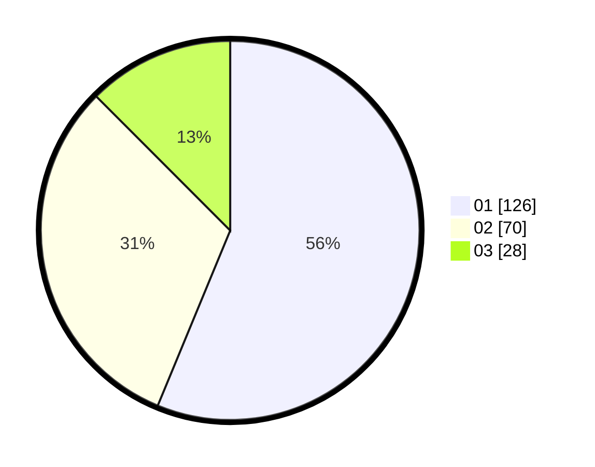

# Hasil

Hasil perolehan suara paslon dapat dilihat pada file paslon-01.txt, paslon-02.txt, dan paslon-03.txt.

Jika tidak ada, artinya data tersebut belum ada pada SIREKAP.

## Perolehan Suara

 * Paslon 01: **126**.
 * Paslon 02: **70**.
 * Paslon 03: **28**.

## Foto C Plano

https://sirekap-obj-formc.kpu.go.id/6b97/pemilu/ppwp/31/75/07/10/03/3175071003109-20240214-195554--b768bab6-17ef-4216-8d9c-917799e38e77.jpg

https://sirekap-obj-formc.kpu.go.id/6b97/pemilu/ppwp/31/75/07/10/03/3175071003109-20240214-192918--039c286c-0ecd-43be-9adb-f0c66d706436.jpg

https://sirekap-obj-formc.kpu.go.id/6b97/pemilu/ppwp/31/75/07/10/03/3175071003109-20240214-193656--3e18fa93-bf94-468b-beb8-5ca2ff9bb52c.jpg

## DATA PEMILIH TETAP

Jumlah pemilih dalam DPT: **273**.
 * L: **130**.
 * P: **143**.

## DATA PENGGUNA HAK PILIH

Jumlah pengguna hak pilih dalam DPT: **273**.
 * L: **130**.
 * P: **143**.

Jumlah pengguna hak pilih dalam DPTb: **0**.
 * L: **0**.
 * P: **0**.

Jumlah pengguna hak pilih dalam DPK: **2**.
 * L: **0**.
 * P: **2**.

Jumlah pengguna hak pilih: **275**.
 * L: **130**.
 * P: **145**.

## JUMLAH SUARA SAH DAN TIDAK SAH

JUMLAH SELURUH SUARA SAH: **224**.

JUMLAH SUARA TIDAK SAH: **4**.

JUMLAH SELURUH SUARA SAH DAN SUARA TIDAK SAH: **228**.
