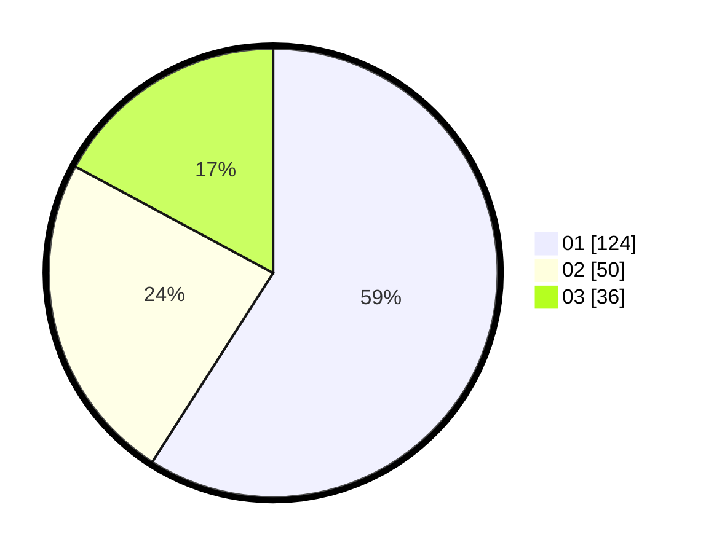

# Hasil

Hasil perolehan suara paslon dapat dilihat pada file paslon-01.txt, paslon-02.txt, dan paslon-03.txt.

Jika tidak ada, artinya data tersebut belum ada pada SIREKAP.

## Perolehan Suara

 * Paslon 01: **124**.
 * Paslon 02: **50**.
 * Paslon 03: **36**.

## Foto C Plano

https://sirekap-obj-formc.kpu.go.id/93b4/pemilu/ppwp/31/75/07/10/03/3175071003110-20240214-214852--5be10ec5-9923-49a8-886e-0e7d3a2ccbbd.jpg

https://sirekap-obj-formc.kpu.go.id/93b4/pemilu/ppwp/31/75/07/10/03/3175071003110-20240214-230310--1159dcc1-499f-4377-a8ba-492a434b9d44.jpg

https://sirekap-obj-formc.kpu.go.id/93b4/pemilu/ppwp/31/75/07/10/03/3175071003110-20240214-215049--7026af9a-858b-41e9-898d-361f8bc4796d.jpg

## DATA PEMILIH TETAP

Jumlah pemilih dalam DPT: **263**.
 * L: **138**.
 * P: **125**.

## DATA PENGGUNA HAK PILIH

Jumlah pengguna hak pilih dalam DPT: **207**.
 * L: **101**.
 * P: **106**.

Jumlah pengguna hak pilih dalam DPTb: **1**.
 * L: **0**.
 * P: **1**.

Jumlah pengguna hak pilih dalam DPK: **3**.
 * L: **2**.
 * P: **1**.

Jumlah pengguna hak pilih: **211**.
 * L: **103**.
 * P: **108**.

## JUMLAH SUARA SAH DAN TIDAK SAH

JUMLAH SELURUH SUARA SAH: **210**.

JUMLAH SUARA TIDAK SAH: **2**.

JUMLAH SELURUH SUARA SAH DAN SUARA TIDAK SAH: **212**.
