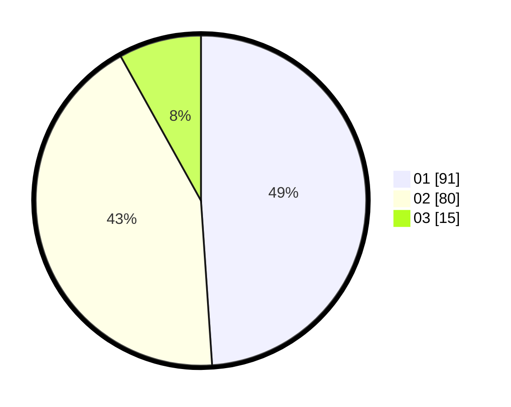

# Hasil

Hasil perolehan suara paslon dapat dilihat pada file paslon-01.txt, paslon-02.txt, dan paslon-03.txt.

Jika tidak ada, artinya data tersebut belum ada pada SIREKAP.

## Perolehan Suara

 * Paslon 01: **91**.
 * Paslon 02: **80**.
 * Paslon 03: **15**.

## Foto C Plano

https://sirekap-obj-formc.kpu.go.id/e814/pemilu/ppwp/31/75/07/10/03/3175071003112-20240216-145320--6f4e9fff-6f34-4bf1-b0f1-94618008706c.jpg

https://sirekap-obj-formc.kpu.go.id/e814/pemilu/ppwp/31/75/07/10/03/3175071003112-20240216-145321--92be7a2b-f1f9-4f7e-8f8d-d3854c0e63ff.jpg

https://sirekap-obj-formc.kpu.go.id/e814/pemilu/ppwp/31/75/07/10/03/3175071003112-20240216-145320--d23511ab-8ae8-491a-a0c3-3eb257449f96.jpg

## DATA PEMILIH TETAP

Jumlah pemilih dalam DPT: **277**.
 * L: **135**.
 * P: **142**.

## DATA PENGGUNA HAK PILIH

Jumlah pengguna hak pilih dalam DPT: **186**.
 * L: **89**.
 * P: **97**.

Jumlah pengguna hak pilih dalam DPTb: **0**.
 * L: **0**.
 * P: **0**.

Jumlah pengguna hak pilih dalam DPK: **1**.
 * L: **0**.
 * P: **1**.

Jumlah pengguna hak pilih: **187**.
 * L: **89**.
 * P: **98**.

## JUMLAH SUARA SAH DAN TIDAK SAH

JUMLAH SELURUH SUARA SAH: **186**.

JUMLAH SUARA TIDAK SAH: **1**.

JUMLAH SELURUH SUARA SAH DAN SUARA TIDAK SAH: **187**.
