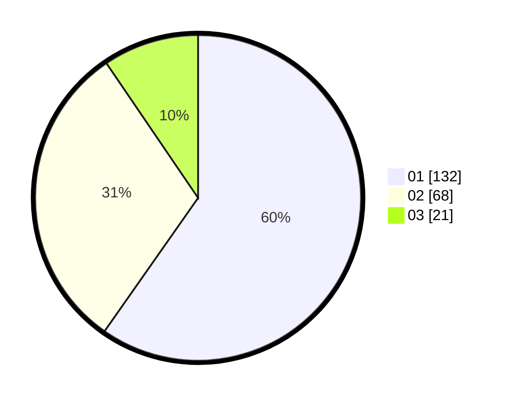

# Hasil

Hasil perolehan suara paslon dapat dilihat pada file paslon-01.txt, paslon-02.txt, dan paslon-03.txt.

Jika tidak ada, artinya data tersebut belum ada pada SIREKAP.

## Perolehan Suara

 * Paslon 01: **132**.
 * Paslon 02: **68**.
 * Paslon 03: **21**.

## Foto C Plano

https://sirekap-obj-formc.kpu.go.id/f9a2/pemilu/ppwp/31/75/07/10/03/3175071003118-20240216-141333--144f51b9-9843-483d-8c99-0129d26963ee.jpg

https://sirekap-obj-formc.kpu.go.id/f9a2/pemilu/ppwp/31/75/07/10/03/3175071003118-20240216-141334--31c0874e-e2c6-423a-9459-5dd658f21803.jpg

https://sirekap-obj-formc.kpu.go.id/f9a2/pemilu/ppwp/31/75/07/10/03/3175071003118-20240216-141333--f43522ab-7bad-492f-9b8c-69c64da39186.jpg

## DATA PEMILIH TETAP

Jumlah pemilih dalam DPT: **281**.
 * L: **138**.
 * P: **143**.

## DATA PENGGUNA HAK PILIH

Jumlah pengguna hak pilih dalam DPT: **218**.
 * L: **102**.
 * P: **116**.

Jumlah pengguna hak pilih dalam DPTb: **3**.
 * L: **2**.
 * P: **1**.

Jumlah pengguna hak pilih dalam DPK: **4**.
 * L: **3**.
 * P: **1**.

Jumlah pengguna hak pilih: **225**.
 * L: **107**.
 * P: **118**.

## JUMLAH SUARA SAH DAN TIDAK SAH

JUMLAH SELURUH SUARA SAH: **221**.

JUMLAH SUARA TIDAK SAH: **4**.

JUMLAH SELURUH SUARA SAH DAN SUARA TIDAK SAH: **225**.
