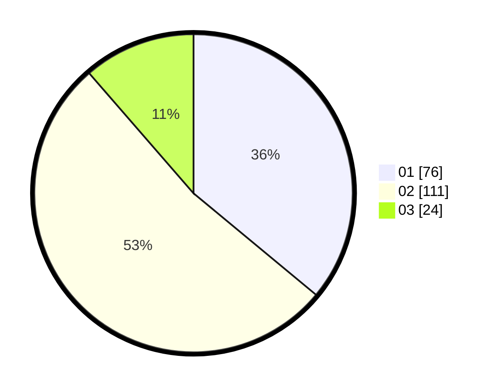

# Hasil

Hasil perolehan suara paslon dapat dilihat pada file paslon-01.txt, paslon-02.txt, dan paslon-03.txt.

Jika tidak ada, artinya data tersebut belum ada pada SIREKAP.

## Perolehan Suara

 * Paslon 01: **76**.
 * Paslon 02: **111**.
 * Paslon 03: **24**.

## Foto C Plano

https://sirekap-obj-formc.kpu.go.id/4ef1/pemilu/ppwp/31/75/07/10/03/3175071003124-20240214-232223--21280290-1dcb-4ff9-af69-6a0fff389ee8.jpg

https://sirekap-obj-formc.kpu.go.id/4ef1/pemilu/ppwp/31/75/07/10/03/3175071003124-20240214-232339--e7f0011b-eceb-4c42-9eb8-6d11fbb3103f.jpg

https://sirekap-obj-formc.kpu.go.id/4ef1/pemilu/ppwp/31/75/07/10/03/3175071003124-20240214-232441--93f6176f-d502-4874-a89e-0da73c4cae6b.jpg
