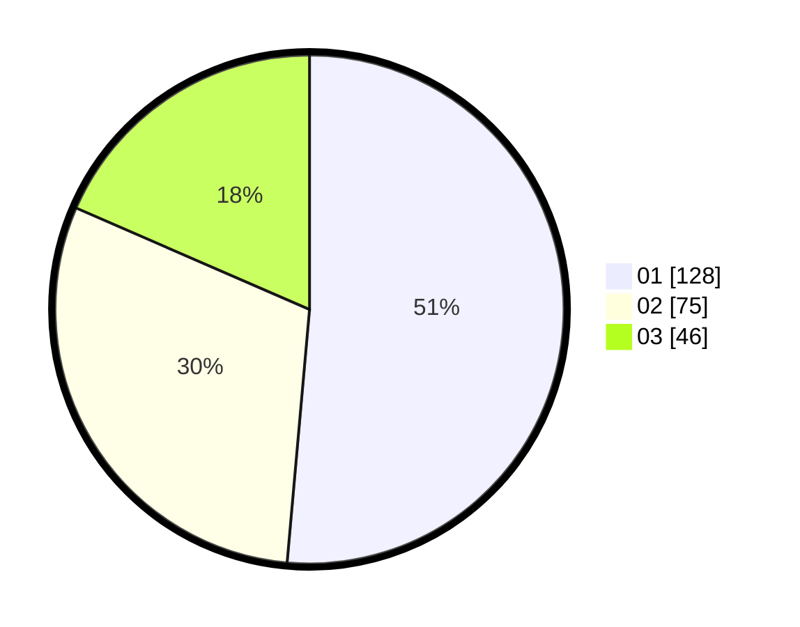

# Hasil

Hasil perolehan suara paslon dapat dilihat pada file paslon-01.txt, paslon-02.txt, dan paslon-03.txt.

Jika tidak ada, artinya data tersebut belum ada pada SIREKAP.

## Perolehan Suara

 * Paslon 01: **128**.
 * Paslon 02: **75**.
 * Paslon 03: **46**.

## Foto C Plano

https://sirekap-obj-formc.kpu.go.id/9a4f/pemilu/ppwp/31/75/07/10/03/3175071003129-20240215-021831--fb572b2e-8dc0-4271-a643-80cd2cc3c889.jpg

https://sirekap-obj-formc.kpu.go.id/9a4f/pemilu/ppwp/31/75/07/10/03/3175071003129-20240215-021827--9544a402-97e7-477e-a1bf-09c4a096ee31.jpg

https://sirekap-obj-formc.kpu.go.id/9a4f/pemilu/ppwp/31/75/07/10/03/3175071003129-20240215-021822--7305360c-7210-4713-a7c8-51b5751d5e99.jpg
