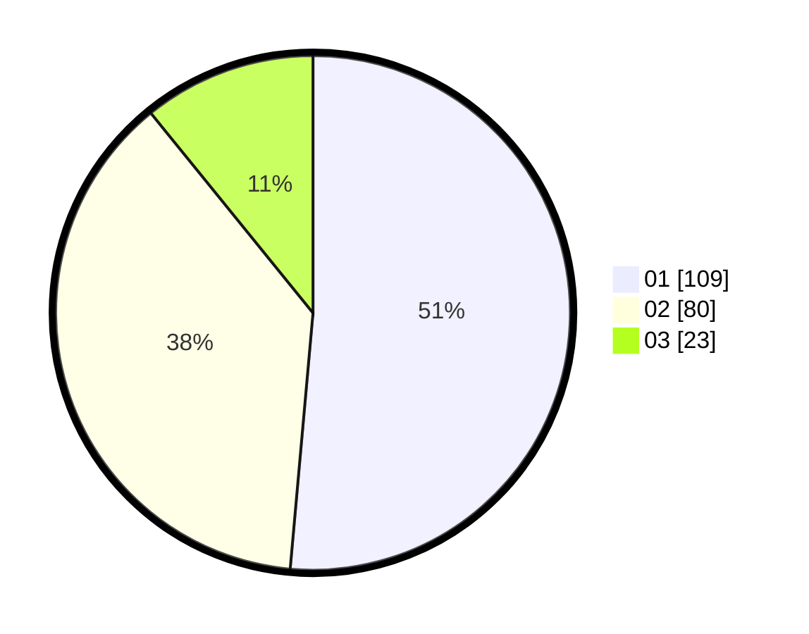

# Hasil

Hasil perolehan suara paslon dapat dilihat pada file paslon-01.txt, paslon-02.txt, dan paslon-03.txt.

Jika tidak ada, artinya data tersebut belum ada pada SIREKAP.

## Perolehan Suara

 * Paslon 01: **109**.
 * Paslon 02: **80**.
 * Paslon 03: **23**.

## Foto C Plano

https://sirekap-obj-formc.kpu.go.id/3e54/pemilu/ppwp/31/75/07/10/03/3175071003135-20240215-015501--ad80f5b4-f28a-4d63-ac22-f4449aa383a8.jpg

https://sirekap-obj-formc.kpu.go.id/3e54/pemilu/ppwp/31/75/07/10/03/3175071003135-20240215-015637--78678711-318b-4ed3-9cff-393b5c1004b5.jpg

https://sirekap-obj-formc.kpu.go.id/3e54/pemilu/ppwp/31/75/07/10/03/3175071003135-20240215-015807--38393c63-9642-47be-90fe-189665f40d3c.jpg
