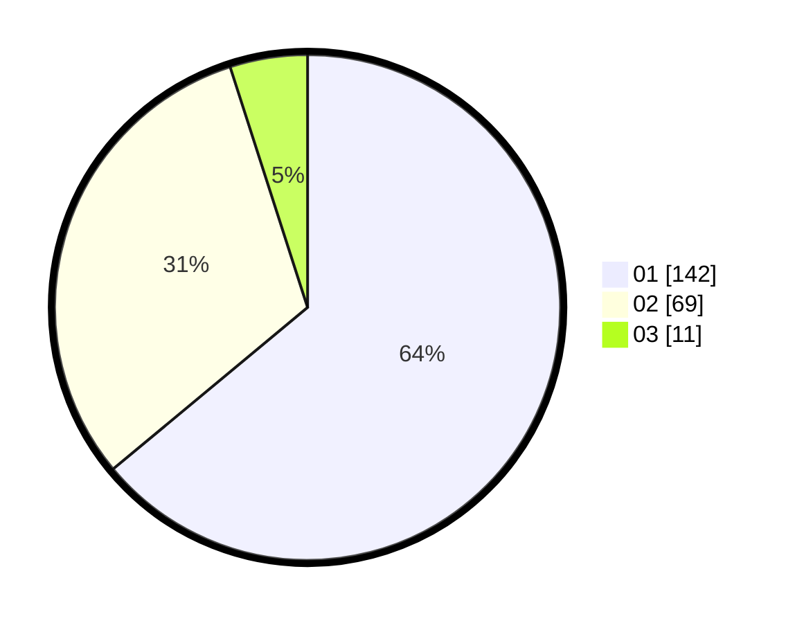

# Hasil

Hasil perolehan suara paslon dapat dilihat pada file paslon-01.txt, paslon-02.txt, dan paslon-03.txt.

Jika tidak ada, artinya data tersebut belum ada pada SIREKAP.

## Perolehan Suara

 * Paslon 01: **142**.
 * Paslon 02: **69**.
 * Paslon 03: **11**.

## Foto C Plano

https://sirekap-obj-formc.kpu.go.id/d08e/pemilu/ppwp/31/75/07/10/03/3175071003137-20240215-020021--b5718b8d-00fa-4678-af1e-fc4f9f16eb17.jpg

https://sirekap-obj-formc.kpu.go.id/d08e/pemilu/ppwp/31/75/07/10/03/3175071003137-20240215-020109--d32963ab-af26-4a87-a0d2-e1463dcb1684.jpg

https://sirekap-obj-formc.kpu.go.id/d08e/pemilu/ppwp/31/75/07/10/03/3175071003137-20240215-015616--1748e59e-6942-48a4-bf2d-9d7a573aed2e.jpg
