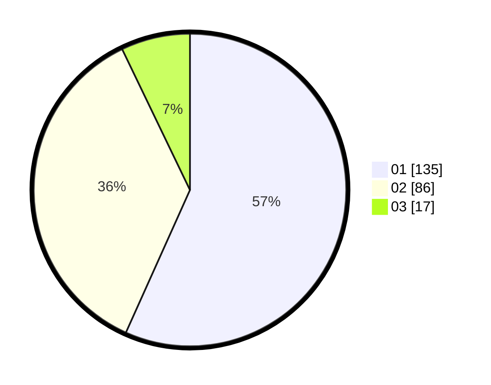

# Hasil

Hasil perolehan suara paslon dapat dilihat pada file paslon-01.txt, paslon-02.txt, dan paslon-03.txt.

Jika tidak ada, artinya data tersebut belum ada pada SIREKAP.

## Perolehan Suara

 * Paslon 01: **135**.
 * Paslon 02: **86**.
 * Paslon 03: **17**.

## Foto C Plano

https://sirekap-obj-formc.kpu.go.id/acdc/pemilu/ppwp/31/75/07/10/03/3175071003139-20240214-214325--e643d5e8-b2b6-479d-bbd0-97f78688b18b.jpg

https://sirekap-obj-formc.kpu.go.id/acdc/pemilu/ppwp/31/75/07/10/03/3175071003139-20240214-214422--b1a3d46c-881d-4e4f-af37-dd0c3d58d32a.jpg

https://sirekap-obj-formc.kpu.go.id/acdc/pemilu/ppwp/31/75/07/10/03/3175071003139-20240214-214554--cb417bf4-21be-4132-974c-19a6b2467fc0.jpg

## DATA PEMILIH TETAP

Jumlah pemilih dalam DPT: **284**.
 * L: **733**.
 * P: **257**.

## DATA PENGGUNA HAK PILIH

Jumlah pengguna hak pilih dalam DPT: **236**.
 * L: **111**.
 * P: **125**.

Jumlah pengguna hak pilih dalam DPTb: **1**.
 * L: **1**.
 * P: **0**.

Jumlah pengguna hak pilih dalam DPK: **2**.
 * L: **7**.
 * P: **0**.

Jumlah pengguna hak pilih: **238**.
 * L: **313**.
 * P: **325**.

## JUMLAH SUARA SAH DAN TIDAK SAH

JUMLAH SELURUH SUARA SAH: **238**.

JUMLAH SUARA TIDAK SAH: **2**.

JUMLAH SELURUH SUARA SAH DAN SUARA TIDAK SAH: **240**.
