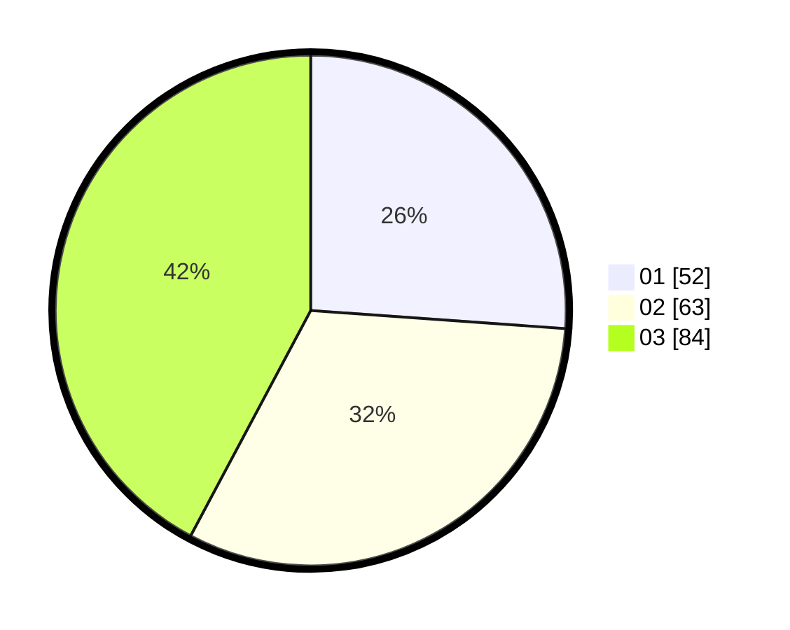

# Hasil

Hasil perolehan suara paslon dapat dilihat pada file paslon-01.txt, paslon-02.txt, dan paslon-03.txt.

Jika tidak ada, artinya data tersebut belum ada pada SIREKAP.

## Perolehan Suara

 * Paslon 01: **52**.
 * Paslon 02: **63**.
 * Paslon 03: **84**.

## Foto C Plano

https://sirekap-obj-formc.kpu.go.id/d92d/pemilu/ppwp/31/75/07/10/03/3175071003143-20240214-224820--795d5df5-ad1f-48a3-a71b-5614841308ea.jpg

https://sirekap-obj-formc.kpu.go.id/d92d/pemilu/ppwp/31/75/07/10/03/3175071003143-20240214-203521--a1230afe-e3d9-4699-a338-4455ab52b424.jpg

https://sirekap-obj-formc.kpu.go.id/d92d/pemilu/ppwp/31/75/07/10/03/3175071003143-20240214-213350--9cbbba67-fe80-4506-8040-4d2addd426b5.jpg

## DATA PEMILIH TETAP

Jumlah pemilih dalam DPT: **258**.
 * L: **119**.
 * P: **139**.

## DATA PENGGUNA HAK PILIH

Jumlah pengguna hak pilih dalam DPT: **196**.
 * L: **91**.
 * P: **105**.

Jumlah pengguna hak pilih dalam DPTb: **4**.
 * L: **1**.
 * P: **3**.

Jumlah pengguna hak pilih dalam DPK: **1**.
 * L: **0**.
 * P: **1**.

Jumlah pengguna hak pilih: **201**.
 * L: **92**.
 * P: **109**.

## JUMLAH SUARA SAH DAN TIDAK SAH

JUMLAH SELURUH SUARA SAH: **199**.

JUMLAH SUARA TIDAK SAH: **2**.

JUMLAH SELURUH SUARA SAH DAN SUARA TIDAK SAH: **201**.
