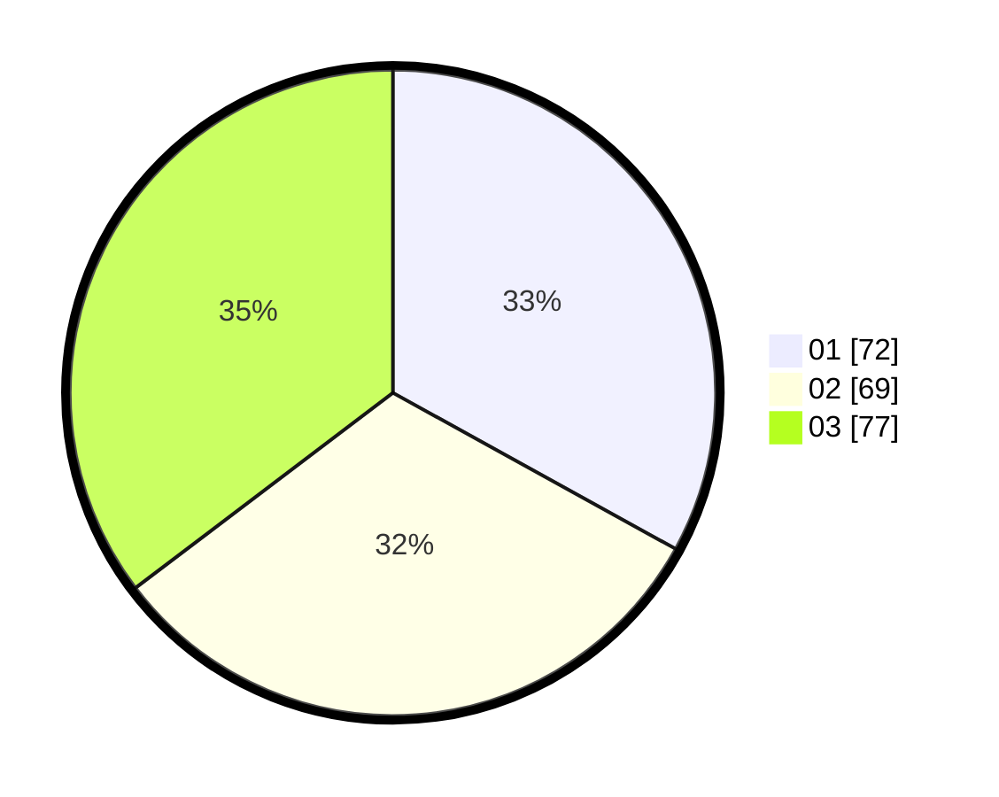

# Hasil

Hasil perolehan suara paslon dapat dilihat pada file paslon-01.txt, paslon-02.txt, dan paslon-03.txt.

Jika tidak ada, artinya data tersebut belum ada pada SIREKAP.

## Perolehan Suara

 * Paslon 01: **72**.
 * Paslon 02: **69**.
 * Paslon 03: **77**.

## Foto C Plano

https://sirekap-obj-formc.kpu.go.id/d8cd/pemilu/ppwp/31/75/07/10/03/3175071003144-20240214-195432--24054258-9b13-4add-bb96-d7d6529ab1b3.jpg

https://sirekap-obj-formc.kpu.go.id/d8cd/pemilu/ppwp/31/75/07/10/03/3175071003144-20240214-194114--b898bf6e-c1a7-4ce5-b388-00122333ad63.jpg

https://sirekap-obj-formc.kpu.go.id/d8cd/pemilu/ppwp/31/75/07/10/03/3175071003144-20240214-200346--b47ad183-5bfd-4e5a-ab6c-76e7e57e9ff5.jpg
