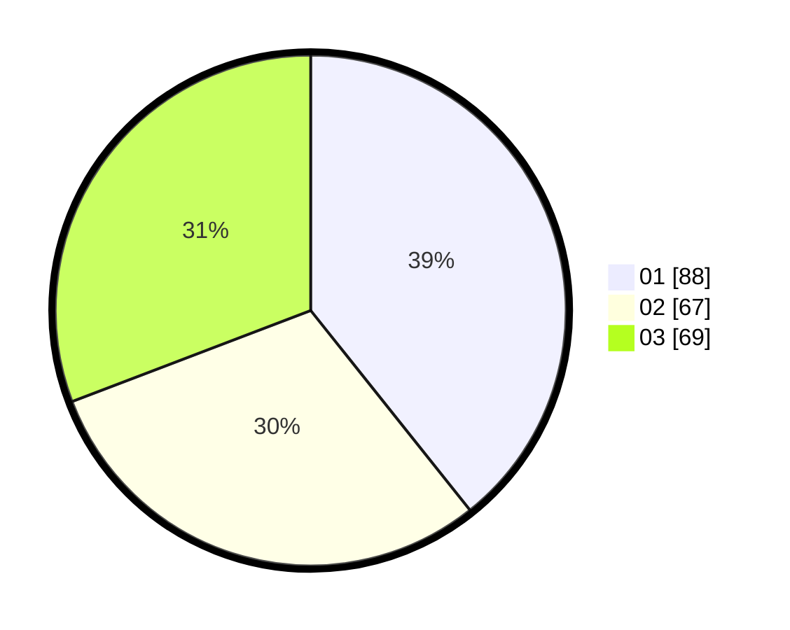

# Hasil

Hasil perolehan suara paslon dapat dilihat pada file paslon-01.txt, paslon-02.txt, dan paslon-03.txt.

Jika tidak ada, artinya data tersebut belum ada pada SIREKAP.

## Perolehan Suara

 * Paslon 01: **88**.
 * Paslon 02: **67**.
 * Paslon 03: **69**.

## Foto C Plano

https://sirekap-obj-formc.kpu.go.id/fbc5/pemilu/ppwp/31/75/07/10/03/3175071003146-20240214-184801--28db5b28-ce0e-4fa3-b704-fbfb88819a09.jpg

https://sirekap-obj-formc.kpu.go.id/fbc5/pemilu/ppwp/31/75/07/10/03/3175071003146-20240214-184810--a1e9e1ed-b2bc-4af8-90dd-d9c28bcc0c66.jpg

https://sirekap-obj-formc.kpu.go.id/fbc5/pemilu/ppwp/31/75/07/10/03/3175071003146-20240214-184816--bbab9c38-4e49-47bb-aba8-1a1ddc3cd96e.jpg

## DATA PEMILIH TETAP

Jumlah pemilih dalam DPT: **271**.
 * L: **129**.
 * P: **142**.

## DATA PENGGUNA HAK PILIH

Jumlah pengguna hak pilih dalam DPT: **227**.
 * L: **107**.
 * P: **120**.

Jumlah pengguna hak pilih dalam DPTb: **1**.
 * L: **0**.
 * P: **1**.

Jumlah pengguna hak pilih dalam DPK: **0**.
 * L: **0**.
 * P: **0**.

Jumlah pengguna hak pilih: **228**.
 * L: **107**.
 * P: **121**.

## JUMLAH SUARA SAH DAN TIDAK SAH

JUMLAH SELURUH SUARA SAH: **224**.

JUMLAH SUARA TIDAK SAH: **4**.

JUMLAH SELURUH SUARA SAH DAN SUARA TIDAK SAH: **228**.
