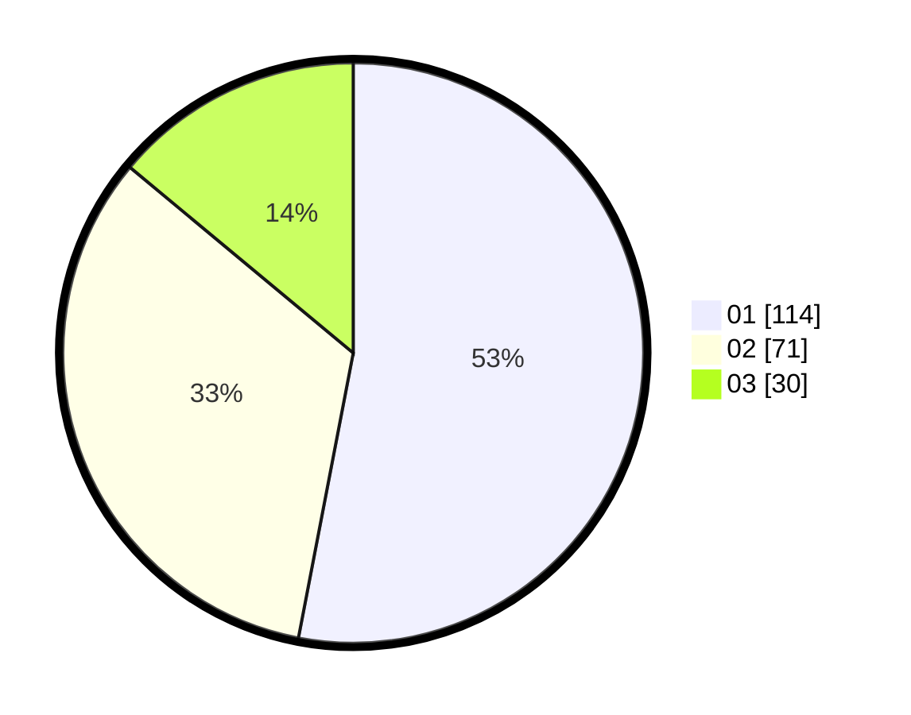

# Hasil

Hasil perolehan suara paslon dapat dilihat pada file paslon-01.txt, paslon-02.txt, dan paslon-03.txt.

Jika tidak ada, artinya data tersebut belum ada pada SIREKAP.

## Perolehan Suara

 * Paslon 01: **114**.
 * Paslon 02: **71**.
 * Paslon 03: **30**.

## Foto C Plano

https://sirekap-obj-formc.kpu.go.id/c5a8/pemilu/ppwp/31/75/07/10/03/3175071003148-20240215-011742--4a0dc27f-ea33-461f-a9b7-c584d9a84e7d.jpg

https://sirekap-obj-formc.kpu.go.id/c5a8/pemilu/ppwp/31/75/07/10/03/3175071003148-20240215-200054--8ef2ea41-b479-4912-9040-b789db77c9e2.jpg

https://sirekap-obj-formc.kpu.go.id/c5a8/pemilu/ppwp/31/75/07/10/03/3175071003148-20240215-012914--9d5d2b06-8bec-4247-a835-65f6ed2f048e.jpg
