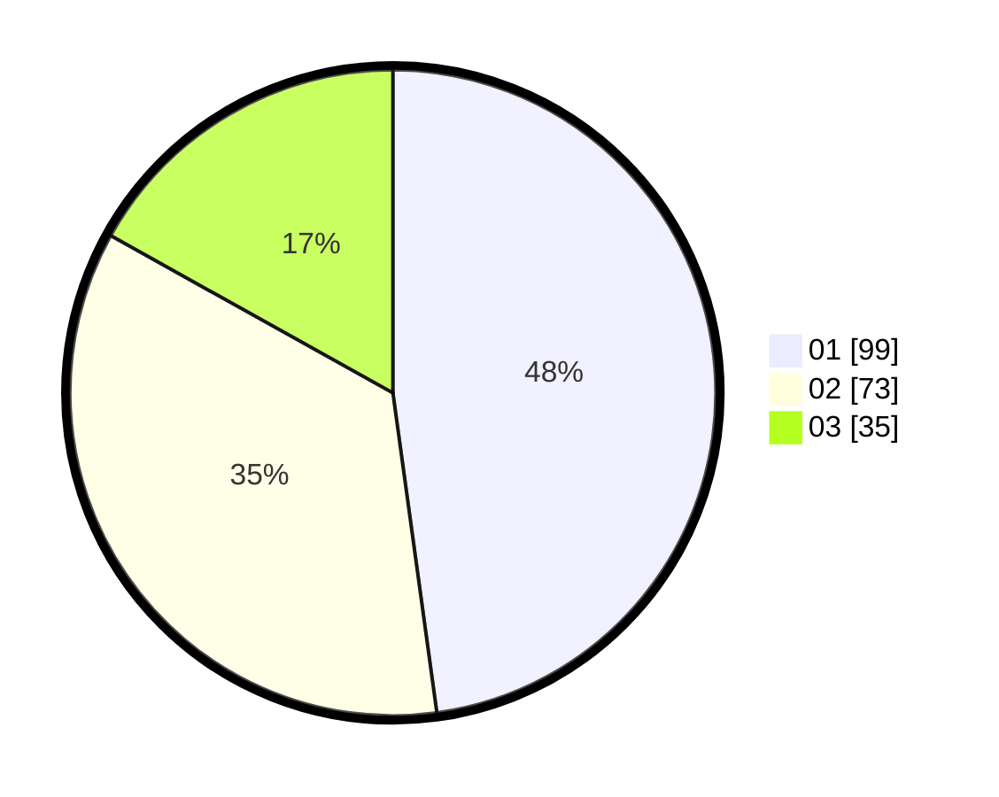

# Hasil

Hasil perolehan suara paslon dapat dilihat pada file paslon-01.txt, paslon-02.txt, dan paslon-03.txt.

Jika tidak ada, artinya data tersebut belum ada pada SIREKAP.

## Perolehan Suara

 * Paslon 01: **99**.
 * Paslon 02: **73**.
 * Paslon 03: **35**.

## Foto C Plano

https://sirekap-obj-formc.kpu.go.id/6b42/pemilu/ppwp/31/75/07/10/03/3175071003154-20240215-134138--16d9a629-e8a4-4166-be87-0395dd0279b9.jpg

https://sirekap-obj-formc.kpu.go.id/6b42/pemilu/ppwp/31/75/07/10/03/3175071003154-20240214-185506--7c5a018a-e874-4f3f-8338-80a5d67b7108.jpg

https://sirekap-obj-formc.kpu.go.id/6b42/pemilu/ppwp/31/75/07/10/03/3175071003154-20240214-185553--80c024f4-bc4e-4a34-aff6-54496dbaa543.jpg
