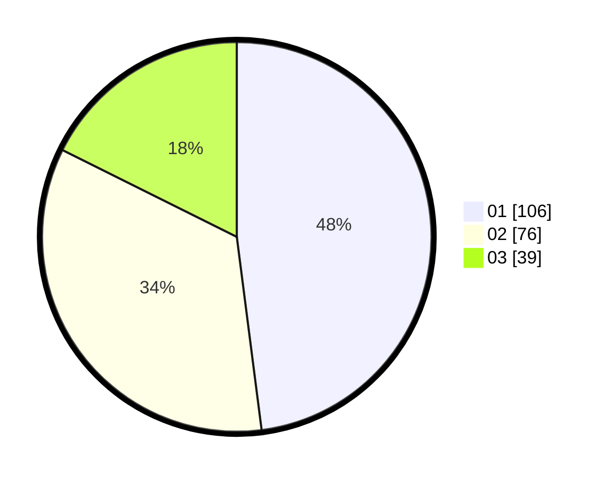

# Hasil

Hasil perolehan suara paslon dapat dilihat pada file paslon-01.txt, paslon-02.txt, dan paslon-03.txt.

Jika tidak ada, artinya data tersebut belum ada pada SIREKAP.

## Perolehan Suara

 * Paslon 01: **106**.
 * Paslon 02: **76**.
 * Paslon 03: **39**.

## Foto C Plano

https://sirekap-obj-formc.kpu.go.id/61e0/pemilu/ppwp/31/75/07/10/03/3175071003159-20240216-210934--4e1666b0-fc6e-4048-aece-f4a1ede308e6.jpg

https://sirekap-obj-formc.kpu.go.id/61e0/pemilu/ppwp/31/75/07/10/03/3175071003159-20240216-231605--d96b0a72-bbd7-4e1e-9401-4dcc58a646f7.jpg

https://sirekap-obj-formc.kpu.go.id/61e0/pemilu/ppwp/31/75/07/10/03/3175071003159-20240216-210935--7977ada0-bc60-4605-81e7-59e59ad52b5a.jpg

## DATA PEMILIH TETAP

Jumlah pemilih dalam DPT: **279**.
 * L: **140**.
 * P: **139**.

## DATA PENGGUNA HAK PILIH

Jumlah pengguna hak pilih dalam DPT: **207**.
 * L: **101**.
 * P: **106**.

Jumlah pengguna hak pilih dalam DPTb: **4**.
 * L: **3**.
 * P: **1**.

Jumlah pengguna hak pilih dalam DPK: **14**.
 * L: **9**.
 * P: **5**.

Jumlah pengguna hak pilih: **225**.
 * L: **113**.
 * P: **112**.

## JUMLAH SUARA SAH DAN TIDAK SAH

JUMLAH SELURUH SUARA SAH: **221**.

JUMLAH SUARA TIDAK SAH: **4**.

JUMLAH SELURUH SUARA SAH DAN SUARA TIDAK SAH: **225**.
