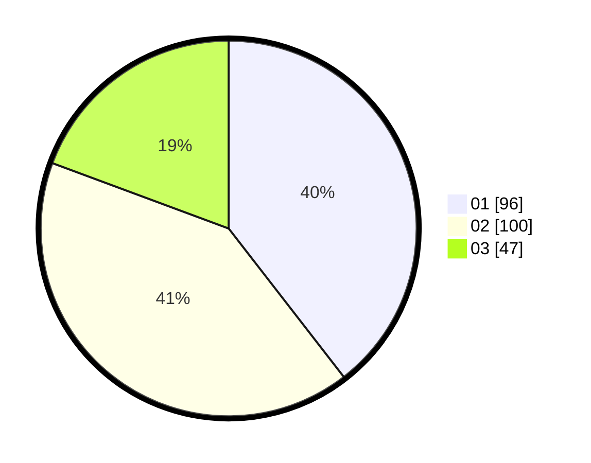

# Hasil

Hasil perolehan suara paslon dapat dilihat pada file paslon-01.txt, paslon-02.txt, dan paslon-03.txt.

Jika tidak ada, artinya data tersebut belum ada pada SIREKAP.

## Perolehan Suara

 * Paslon 01: **96**.
 * Paslon 02: **100**.
 * Paslon 03: **47**.

## Foto C Plano

https://sirekap-obj-formc.kpu.go.id/a048/pemilu/ppwp/31/75/07/10/03/3175071003161-20240215-000150--759cf6b3-8030-476b-a48d-a84b6a46f63b.jpg

https://sirekap-obj-formc.kpu.go.id/a048/pemilu/ppwp/31/75/07/10/03/3175071003161-20240215-000214--6791df9c-0aeb-4c94-9767-f14866a52949.jpg

https://sirekap-obj-formc.kpu.go.id/a048/pemilu/ppwp/31/75/07/10/03/3175071003161-20240215-000229--8b07052c-d029-4449-b695-b42423d2acb0.jpg
