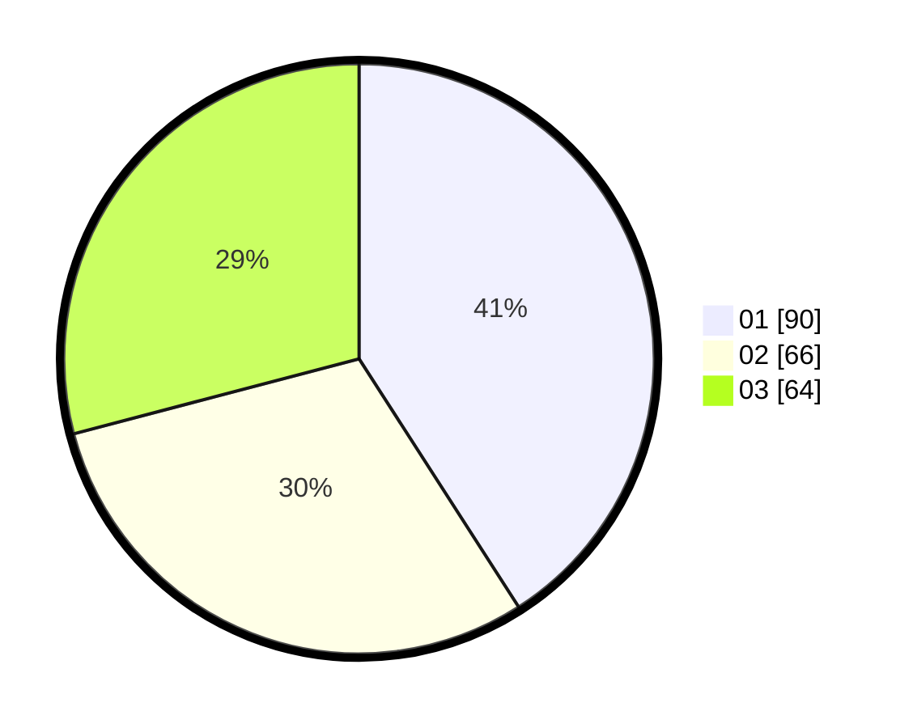

# Hasil

Hasil perolehan suara paslon dapat dilihat pada file paslon-01.txt, paslon-02.txt, dan paslon-03.txt.

Jika tidak ada, artinya data tersebut belum ada pada SIREKAP.

## Perolehan Suara

 * Paslon 01: **90**.
 * Paslon 02: **66**.
 * Paslon 03: **64**.

## Foto C Plano

https://sirekap-obj-formc.kpu.go.id/aa23/pemilu/ppwp/31/75/07/10/03/3175071003163-20240216-150118--348fa3c4-0343-49c0-b557-2ec07a01765c.jpg

https://sirekap-obj-formc.kpu.go.id/aa23/pemilu/ppwp/31/75/07/10/03/3175071003163-20240216-150119--5e55c03e-7282-4b88-bcaf-1191f232d2cb.jpg

https://sirekap-obj-formc.kpu.go.id/aa23/pemilu/ppwp/31/75/07/10/03/3175071003163-20240216-150119--7fae9b7c-83dc-4f9a-bc37-686e1e4a6aad.jpg

## DATA PEMILIH TETAP

Jumlah pemilih dalam DPT: **268**.
 * L: **115**.
 * P: **153**.

## DATA PENGGUNA HAK PILIH

Jumlah pengguna hak pilih dalam DPT: **215**.
 * L: **106**.
 * P: **109**.

Jumlah pengguna hak pilih dalam DPTb: **6**.
 * L: **1**.
 * P: **5**.

Jumlah pengguna hak pilih dalam DPK: **2**.
 * L: **1**.
 * P: **1**.

Jumlah pengguna hak pilih: **223**.
 * L: **108**.
 * P: **115**.

## JUMLAH SUARA SAH DAN TIDAK SAH

JUMLAH SELURUH SUARA SAH: **220**.

JUMLAH SUARA TIDAK SAH: **3**.

JUMLAH SELURUH SUARA SAH DAN SUARA TIDAK SAH: **223**.
