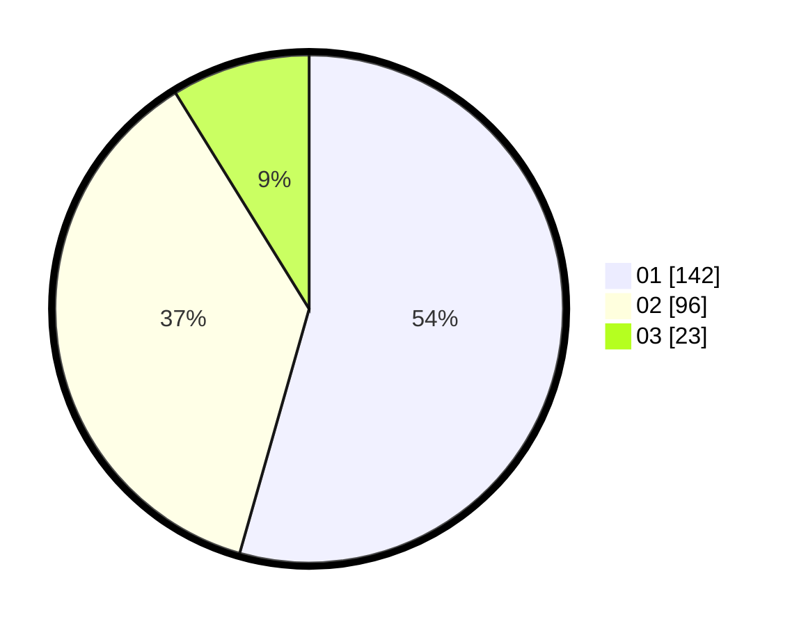

# Hasil

Hasil perolehan suara paslon dapat dilihat pada file paslon-01.txt, paslon-02.txt, dan paslon-03.txt.

Jika tidak ada, artinya data tersebut belum ada pada SIREKAP.

## Perolehan Suara

 * Paslon 01: **142**.
 * Paslon 02: **96**.
 * Paslon 03: **23**.

## Foto C Plano

https://sirekap-obj-formc.kpu.go.id/9bcb/pemilu/ppwp/31/75/07/10/03/3175071003168-20240215-004548--06f9496f-ad00-4e53-8685-9dfd56fc8f4e.jpg

https://sirekap-obj-formc.kpu.go.id/9bcb/pemilu/ppwp/31/75/07/10/03/3175071003168-20240215-004659--96b7415b-1650-4a48-a8ad-2142981481a6.jpg

https://sirekap-obj-formc.kpu.go.id/9bcb/pemilu/ppwp/31/75/07/10/03/3175071003168-20240215-004748--505b412f-9c14-4e12-8b46-2a27e02d0565.jpg
