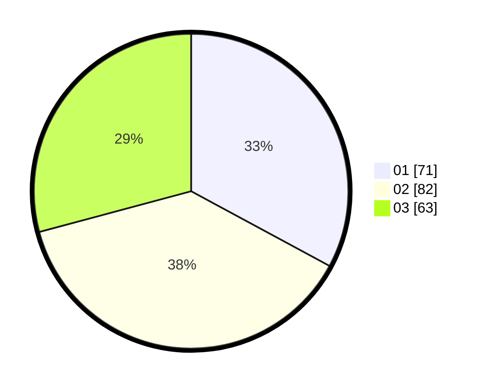

# Hasil

Hasil perolehan suara paslon dapat dilihat pada file paslon-01.txt, paslon-02.txt, dan paslon-03.txt.

Jika tidak ada, artinya data tersebut belum ada pada SIREKAP.

## Perolehan Suara

 * Paslon 01: **71**.
 * Paslon 02: **82**.
 * Paslon 03: **63**.

## Foto C Plano

https://sirekap-obj-formc.kpu.go.id/6fd8/pemilu/ppwp/31/75/07/10/03/3175071003169-20240216-081611--0f7ce12b-2aa0-4143-82e3-d9868fb5f208.jpg

https://sirekap-obj-formc.kpu.go.id/6fd8/pemilu/ppwp/31/75/07/10/03/3175071003169-20240216-081623--d667be03-21e3-4ff1-8272-2ca5c0dfa67f.jpg

https://sirekap-obj-formc.kpu.go.id/6fd8/pemilu/ppwp/31/75/07/10/03/3175071003169-20240216-081620--b6f967b6-faf0-4afa-a459-0e6203e513c2.jpg

## DATA PEMILIH TETAP

Jumlah pemilih dalam DPT: **261**.
 * L: **124**.
 * P: **137**.

## DATA PENGGUNA HAK PILIH

Jumlah pengguna hak pilih dalam DPT: **220**.
 * L: **106**.
 * P: **114**.

Jumlah pengguna hak pilih dalam DPTb: **1**.
 * L: **0**.
 * P: **1**.

Jumlah pengguna hak pilih dalam DPK: **0**.
 * L: **0**.
 * P: **0**.

Jumlah pengguna hak pilih: **221**.
 * L: **106**.
 * P: **115**.

## JUMLAH SUARA SAH DAN TIDAK SAH

JUMLAH SELURUH SUARA SAH: **216**.

JUMLAH SUARA TIDAK SAH: **5**.

JUMLAH SELURUH SUARA SAH DAN SUARA TIDAK SAH: **221**.
