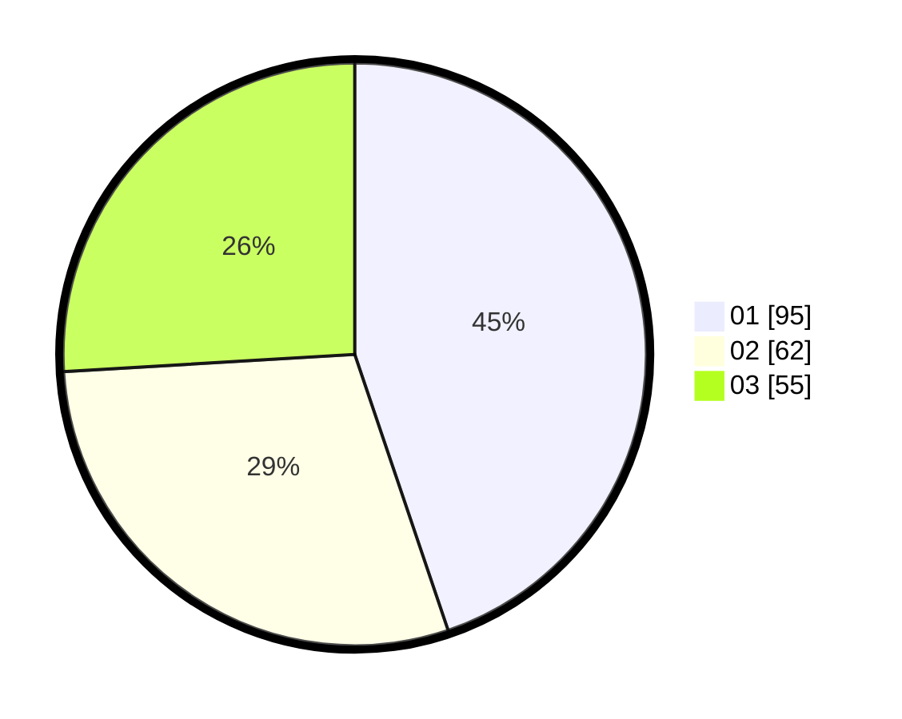

# Hasil

Hasil perolehan suara paslon dapat dilihat pada file paslon-01.txt, paslon-02.txt, dan paslon-03.txt.

Jika tidak ada, artinya data tersebut belum ada pada SIREKAP.

## Perolehan Suara

 * Paslon 01: **95**.
 * Paslon 02: **62**.
 * Paslon 03: **55**.

## Foto C Plano

https://sirekap-obj-formc.kpu.go.id/eb2f/pemilu/ppwp/31/75/07/10/03/3175071003171-20240215-020558--ad930349-7927-459a-9b22-0a462525d8d9.jpg

https://sirekap-obj-formc.kpu.go.id/eb2f/pemilu/ppwp/31/75/07/10/03/3175071003171-20240214-203549--f9279a4d-7ca0-4759-b982-08e5746a01d6.jpg

https://sirekap-obj-formc.kpu.go.id/eb2f/pemilu/ppwp/31/75/07/10/03/3175071003171-20240215-020830--7d2df9ad-5a25-4671-ae30-bb89a71d8cd4.jpg

## DATA PEMILIH TETAP

Jumlah pemilih dalam DPT: **263**.
 * L: **137**.
 * P: **126**.

## DATA PENGGUNA HAK PILIH

Jumlah pengguna hak pilih dalam DPT: **217**.
 * L: **111**.
 * P: **106**.

Jumlah pengguna hak pilih dalam DPTb: **0**.
 * L: **0**.
 * P: **0**.

Jumlah pengguna hak pilih dalam DPK: **1**.
 * L: **1**.
 * P: **0**.

Jumlah pengguna hak pilih: **218**.
 * L: **112**.
 * P: **106**.

## JUMLAH SUARA SAH DAN TIDAK SAH

JUMLAH SELURUH SUARA SAH: **212**.

JUMLAH SUARA TIDAK SAH: **6**.

JUMLAH SELURUH SUARA SAH DAN SUARA TIDAK SAH: **218**.
