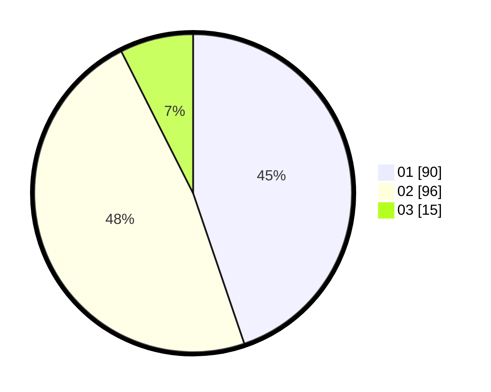

# Hasil

Hasil perolehan suara paslon dapat dilihat pada file paslon-01.txt, paslon-02.txt, dan paslon-03.txt.

Jika tidak ada, artinya data tersebut belum ada pada SIREKAP.

## Perolehan Suara

 * Paslon 01: **90**.
 * Paslon 02: **96**.
 * Paslon 03: **15**.

## Foto C Plano

https://sirekap-obj-formc.kpu.go.id/050d/pemilu/ppwp/31/75/07/10/03/3175071003172-20240215-003738--980bf641-7e7f-4481-a613-0adab232d791.jpg

https://sirekap-obj-formc.kpu.go.id/050d/pemilu/ppwp/31/75/07/10/03/3175071003172-20240215-003124--62950ca6-39a9-4438-a551-6169a47e46ad.jpg

https://sirekap-obj-formc.kpu.go.id/050d/pemilu/ppwp/31/75/07/10/03/3175071003172-20240215-194819--d96097b7-00b1-4541-a950-017286eb153b.jpg
