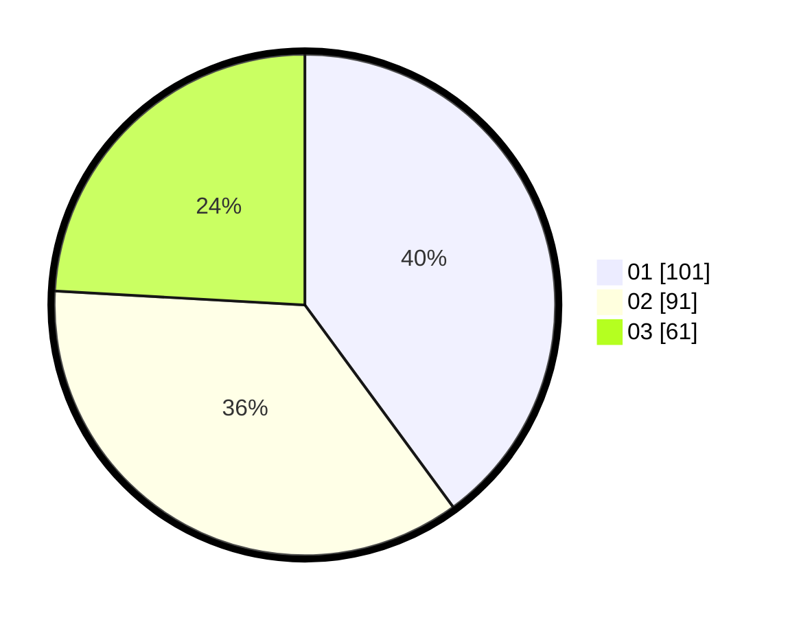

# Hasil

Hasil perolehan suara paslon dapat dilihat pada file paslon-01.txt, paslon-02.txt, dan paslon-03.txt.

Jika tidak ada, artinya data tersebut belum ada pada SIREKAP.

## Perolehan Suara

 * Paslon 01: **101**.
 * Paslon 02: **91**.
 * Paslon 03: **61**.

## Foto C Plano

https://sirekap-obj-formc.kpu.go.id/5491/pemilu/ppwp/31/75/07/10/03/3175071003175-20240214-225344--c99b2a20-ee76-4c2d-9a46-a78f8a97da73.jpg

https://sirekap-obj-formc.kpu.go.id/5491/pemilu/ppwp/31/75/07/10/03/3175071003175-20240214-225442--cb8927e0-4b85-42cb-92e5-b62c3120f5c6.jpg

https://sirekap-obj-formc.kpu.go.id/5491/pemilu/ppwp/31/75/07/10/03/3175071003175-20240214-225653--acda2f87-842a-4dc8-8789-6eb4e66ea385.jpg
