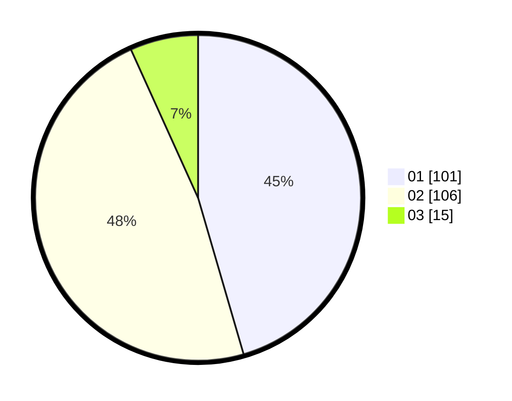

# Hasil

Hasil perolehan suara paslon dapat dilihat pada file paslon-01.txt, paslon-02.txt, dan paslon-03.txt.

Jika tidak ada, artinya data tersebut belum ada pada SIREKAP.

## Perolehan Suara

 * Paslon 01: **101**.
 * Paslon 02: **106**.
 * Paslon 03: **15**.

## Foto C Plano

https://sirekap-obj-formc.kpu.go.id/22f3/pemilu/ppwp/31/75/07/10/03/3175071003180-20240217-181756--a43b8bce-b912-43a9-8b22-e3228ebc4e76.jpg

https://sirekap-obj-formc.kpu.go.id/22f3/pemilu/ppwp/31/75/07/10/03/3175071003180-20240217-181757--fb4c37fb-9a5f-4757-b6d8-3dd055e7a428.jpg

https://sirekap-obj-formc.kpu.go.id/22f3/pemilu/ppwp/31/75/07/10/03/3175071003180-20240217-181757--09505432-0b72-4ec8-a1a5-52e1a87128d6.jpg

## DATA PEMILIH TETAP

Jumlah pemilih dalam DPT: **267**.
 * L: **139**.
 * P: **128**.

## DATA PENGGUNA HAK PILIH

Jumlah pengguna hak pilih dalam DPT: **220**.
 * L: **112**.
 * P: **108**.

Jumlah pengguna hak pilih dalam DPTb: **220**.
 * L: **112**.
 * P: **108**.

Jumlah pengguna hak pilih dalam DPK: **3**.
 * L: **1**.
 * P: **2**.

Jumlah pengguna hak pilih: **223**.
 * L: **113**.
 * P: **110**.

## JUMLAH SUARA SAH DAN TIDAK SAH

JUMLAH SELURUH SUARA SAH: **222**.

JUMLAH SUARA TIDAK SAH: **2**.

JUMLAH SELURUH SUARA SAH DAN SUARA TIDAK SAH: **224**.
