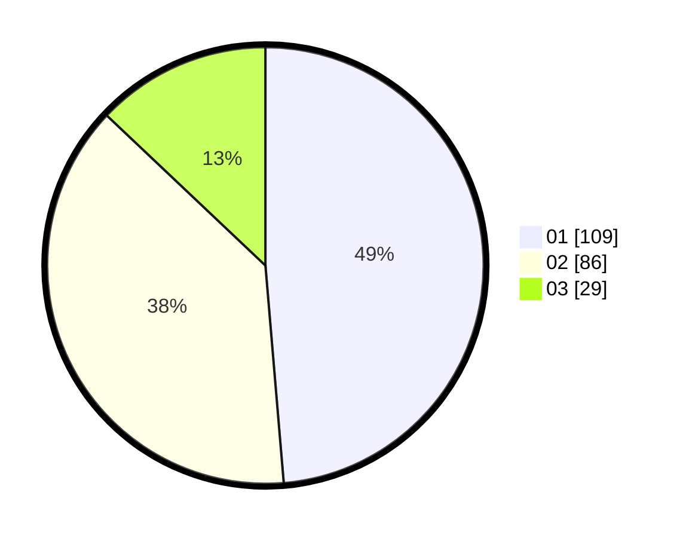

# Hasil

Hasil perolehan suara paslon dapat dilihat pada file paslon-01.txt, paslon-02.txt, dan paslon-03.txt.

Jika tidak ada, artinya data tersebut belum ada pada SIREKAP.

## Perolehan Suara

 * Paslon 01: **109**.
 * Paslon 02: **86**.
 * Paslon 03: **29**.

## Foto C Plano

https://sirekap-obj-formc.kpu.go.id/a609/pemilu/ppwp/31/75/07/10/03/3175071003184-20240215-020250--4056e98a-1d77-44e1-a93a-92873a327a9a.jpg

https://sirekap-obj-formc.kpu.go.id/a609/pemilu/ppwp/31/75/07/10/03/3175071003184-20240215-020312--170b7317-de81-45c2-add9-c91349df7323.jpg

https://sirekap-obj-formc.kpu.go.id/a609/pemilu/ppwp/31/75/07/10/03/3175071003184-20240215-020301--dfb5829a-169c-4b9e-b155-e69f726d92bb.jpg

## DATA PEMILIH TETAP

Jumlah pemilih dalam DPT: **270**.
 * L: **132**.
 * P: **138**.

## DATA PENGGUNA HAK PILIH

Jumlah pengguna hak pilih dalam DPT: **223**.
 * L: **104**.
 * P: **119**.

Jumlah pengguna hak pilih dalam DPTb: **1**.
 * L: **0**.
 * P: **1**.

Jumlah pengguna hak pilih dalam DPK: **2**.
 * L: **1**.
 * P: **1**.

Jumlah pengguna hak pilih: **226**.
 * L: **105**.
 * P: **121**.

## JUMLAH SUARA SAH DAN TIDAK SAH

JUMLAH SELURUH SUARA SAH: **224**.

JUMLAH SUARA TIDAK SAH: **2**.

JUMLAH SELURUH SUARA SAH DAN SUARA TIDAK SAH: **226**.
