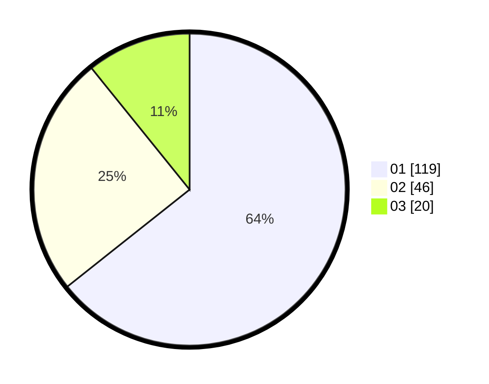

# Hasil

Hasil perolehan suara paslon dapat dilihat pada file paslon-01.txt, paslon-02.txt, dan paslon-03.txt.

Jika tidak ada, artinya data tersebut belum ada pada SIREKAP.

## Perolehan Suara

 * Paslon 01: **119**.
 * Paslon 02: **46**.
 * Paslon 03: **20**.

## Foto C Plano

https://sirekap-obj-formc.kpu.go.id/0917/pemilu/ppwp/31/75/07/10/03/3175071003185-20240215-000500--02c24e40-71d9-4895-bc99-39985558a6d0.jpg

https://sirekap-obj-formc.kpu.go.id/0917/pemilu/ppwp/31/75/07/10/03/3175071003185-20240215-000742--454d8735-d812-4815-8325-3047ebf3d722.jpg

https://sirekap-obj-formc.kpu.go.id/0917/pemilu/ppwp/31/75/07/10/03/3175071003185-20240215-000847--5bb5f5a5-17f5-469d-aa07-fc7df13cf0aa.jpg
