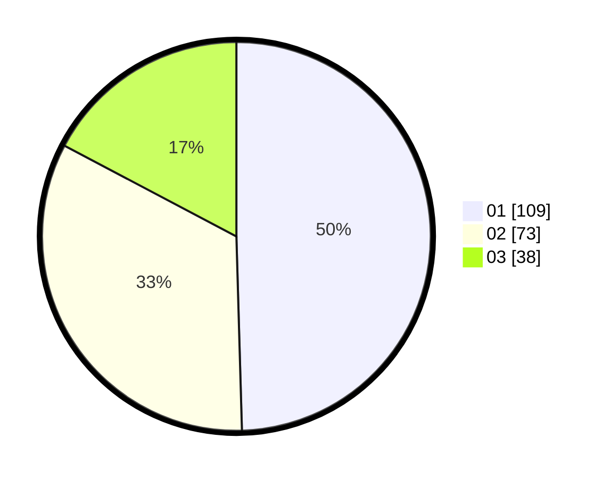

# Hasil

Hasil perolehan suara paslon dapat dilihat pada file paslon-01.txt, paslon-02.txt, dan paslon-03.txt.

Jika tidak ada, artinya data tersebut belum ada pada SIREKAP.

## Perolehan Suara

 * Paslon 01: **109**.
 * Paslon 02: **73**.
 * Paslon 03: **38**.

## Foto C Plano

https://sirekap-obj-formc.kpu.go.id/40c1/pemilu/ppwp/31/75/07/10/03/3175071003191-20240216-113432--ca7b2cb3-4ddc-40bb-922b-15ee6208e1cb.jpg

https://sirekap-obj-formc.kpu.go.id/40c1/pemilu/ppwp/31/75/07/10/03/3175071003191-20240216-113434--96a6a0f9-4b49-4e0f-a935-f14181ccb774.jpg

https://sirekap-obj-formc.kpu.go.id/40c1/pemilu/ppwp/31/75/07/10/03/3175071003191-20240216-113433--5eef5c58-1f10-45ca-9857-885fdcf97a02.jpg

## DATA PEMILIH TETAP

Jumlah pemilih dalam DPT: **281**.
 * L: **142**.
 * P: **139**.

## DATA PENGGUNA HAK PILIH

Jumlah pengguna hak pilih dalam DPT: **219**.
 * L: **105**.
 * P: **114**.

Jumlah pengguna hak pilih dalam DPTb: **3**.
 * L: **2**.
 * P: **1**.

Jumlah pengguna hak pilih dalam DPK: **1**.
 * L: **1**.
 * P: **0**.

Jumlah pengguna hak pilih: **223**.
 * L: **108**.
 * P: **115**.

## JUMLAH SUARA SAH DAN TIDAK SAH

JUMLAH SELURUH SUARA SAH: **220**.

JUMLAH SUARA TIDAK SAH: **3**.

JUMLAH SELURUH SUARA SAH DAN SUARA TIDAK SAH: **223**.
