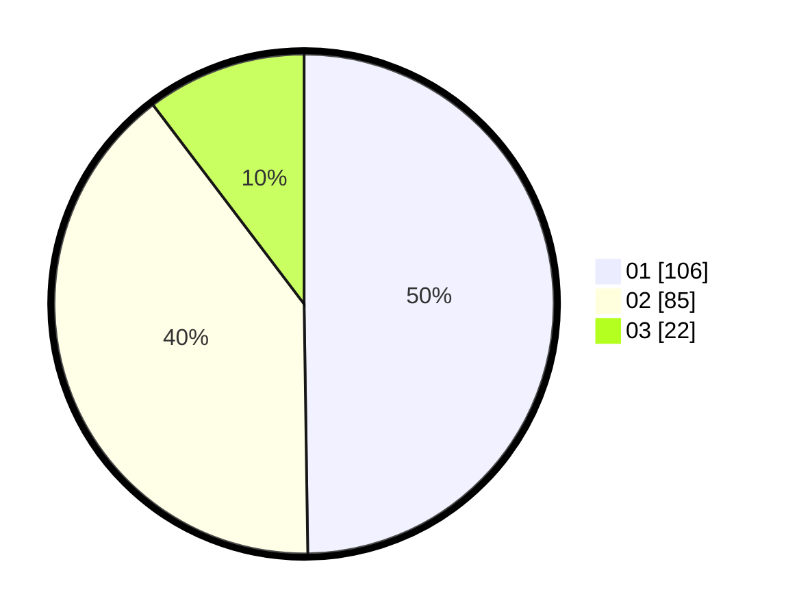

# Hasil

Hasil perolehan suara paslon dapat dilihat pada file paslon-01.txt, paslon-02.txt, dan paslon-03.txt.

Jika tidak ada, artinya data tersebut belum ada pada SIREKAP.

## Perolehan Suara

 * Paslon 01: **106**.
 * Paslon 02: **85**.
 * Paslon 03: **22**.

## Foto C Plano

https://sirekap-obj-formc.kpu.go.id/67a1/pemilu/ppwp/31/75/07/10/03/3175071003195-20240214-190322--b983e7dd-aecd-4139-b97d-840f0d7739c2.jpg

https://sirekap-obj-formc.kpu.go.id/67a1/pemilu/ppwp/31/75/07/10/03/3175071003195-20240214-190537--24965398-0671-4ebe-8d03-a5275dfa2498.jpg

https://sirekap-obj-formc.kpu.go.id/67a1/pemilu/ppwp/31/75/07/10/03/3175071003195-20240214-190713--1d7879e8-c26b-40d6-a100-aa5b40ad840e.jpg

## DATA PEMILIH TETAP

Jumlah pemilih dalam DPT: **213**.
 * L: **98**.
 * P: **115**.

## DATA PENGGUNA HAK PILIH

Jumlah pengguna hak pilih dalam DPT: **213**.
 * L: **98**.
 * P: **115**.

Jumlah pengguna hak pilih dalam DPTb: **0**.
 * L: **0**.
 * P: **0**.

Jumlah pengguna hak pilih dalam DPK: **2**.
 * L: **1**.
 * P: **1**.

Jumlah pengguna hak pilih: **215**.
 * L: **99**.
 * P: **116**.

## JUMLAH SUARA SAH DAN TIDAK SAH

JUMLAH SELURUH SUARA SAH: **213**.

JUMLAH SUARA TIDAK SAH: **2**.

JUMLAH SELURUH SUARA SAH DAN SUARA TIDAK SAH: **215**.
