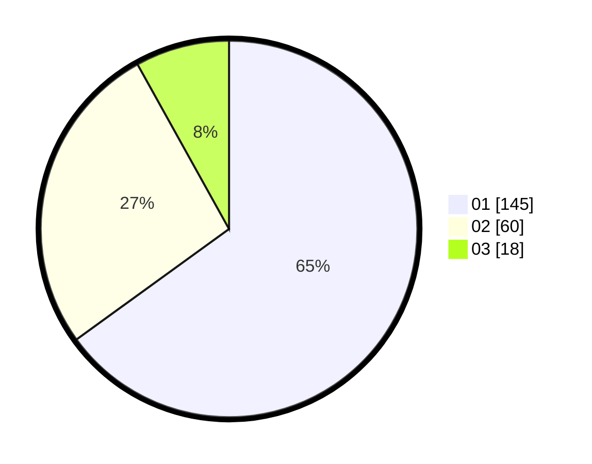

# Hasil

Hasil perolehan suara paslon dapat dilihat pada file paslon-01.txt, paslon-02.txt, dan paslon-03.txt.

Jika tidak ada, artinya data tersebut belum ada pada SIREKAP.

## Perolehan Suara

 * Paslon 01: **145**.
 * Paslon 02: **60**.
 * Paslon 03: **18**.

## Foto C Plano

https://sirekap-obj-formc.kpu.go.id/13c0/pemilu/ppwp/31/75/07/10/03/3175071003196-20240216-140223--967c8ce7-eae1-4e50-937a-c58f64c42b0b.jpg

https://sirekap-obj-formc.kpu.go.id/13c0/pemilu/ppwp/31/75/07/10/03/3175071003196-20240214-184928--f91e189a-3a8f-43df-b952-2950994cd962.jpg

https://sirekap-obj-formc.kpu.go.id/13c0/pemilu/ppwp/31/75/07/10/03/3175071003196-20240216-140224--dbd032e6-3f6e-4169-bd21-737569ba8587.jpg

## DATA PEMILIH TETAP

Jumlah pemilih dalam DPT: **277**.
 * L: **129**.
 * P: **148**.

## DATA PENGGUNA HAK PILIH

Jumlah pengguna hak pilih dalam DPT: **223**.
 * L: **112**.
 * P: **111**.

Jumlah pengguna hak pilih dalam DPTb: **0**.
 * L: **0**.
 * P: **0**.

Jumlah pengguna hak pilih dalam DPK: **1**.
 * L: **0**.
 * P: **1**.

Jumlah pengguna hak pilih: **224**.
 * L: **112**.
 * P: **112**.

## JUMLAH SUARA SAH DAN TIDAK SAH

JUMLAH SELURUH SUARA SAH: **223**.

JUMLAH SUARA TIDAK SAH: **1**.

JUMLAH SELURUH SUARA SAH DAN SUARA TIDAK SAH: **224**.
