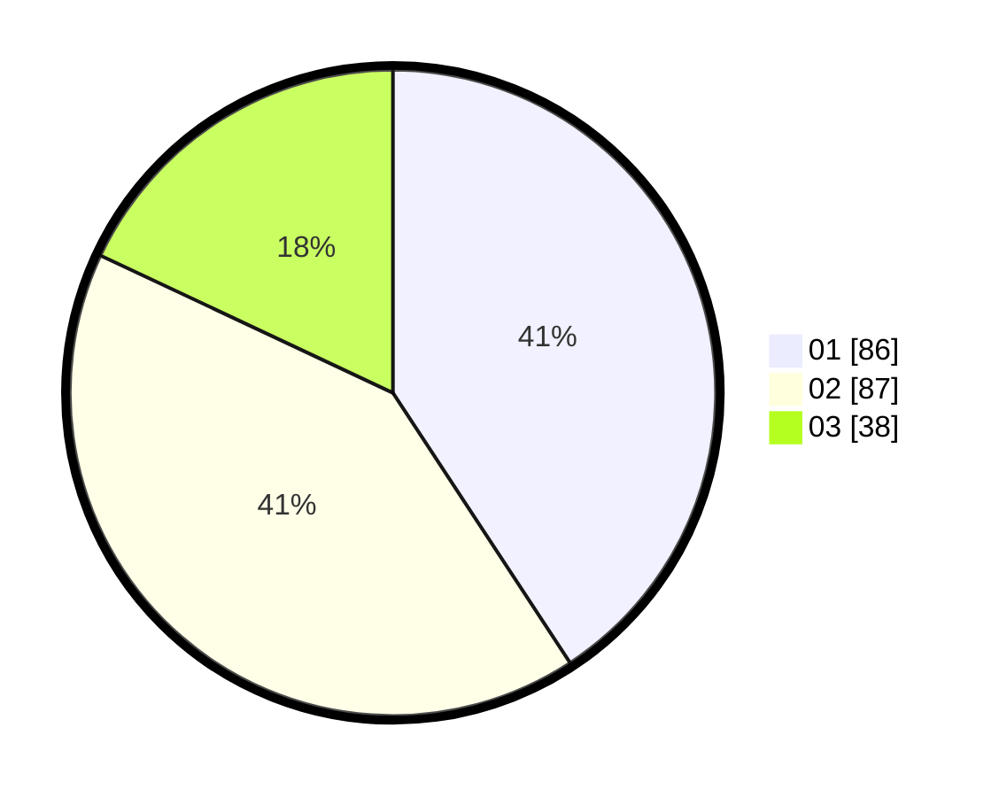

# Hasil

Hasil perolehan suara paslon dapat dilihat pada file paslon-01.txt, paslon-02.txt, dan paslon-03.txt.

Jika tidak ada, artinya data tersebut belum ada pada SIREKAP.

## Perolehan Suara

 * Paslon 01: **86**.
 * Paslon 02: **87**.
 * Paslon 03: **38**.

## Foto C Plano

https://sirekap-obj-formc.kpu.go.id/bead/pemilu/ppwp/31/75/07/10/03/3175071003199-20240215-040421--50ca3adf-9da2-4082-8201-d38e9f4748bf.jpg

https://sirekap-obj-formc.kpu.go.id/bead/pemilu/ppwp/31/75/07/10/03/3175071003199-20240215-040512--2275f955-27a6-40a0-913f-a70592be0599.jpg

https://sirekap-obj-formc.kpu.go.id/bead/pemilu/ppwp/31/75/07/10/03/3175071003199-20240215-040605--5e0ee51b-7c20-4cc8-a4d5-01719b527755.jpg
