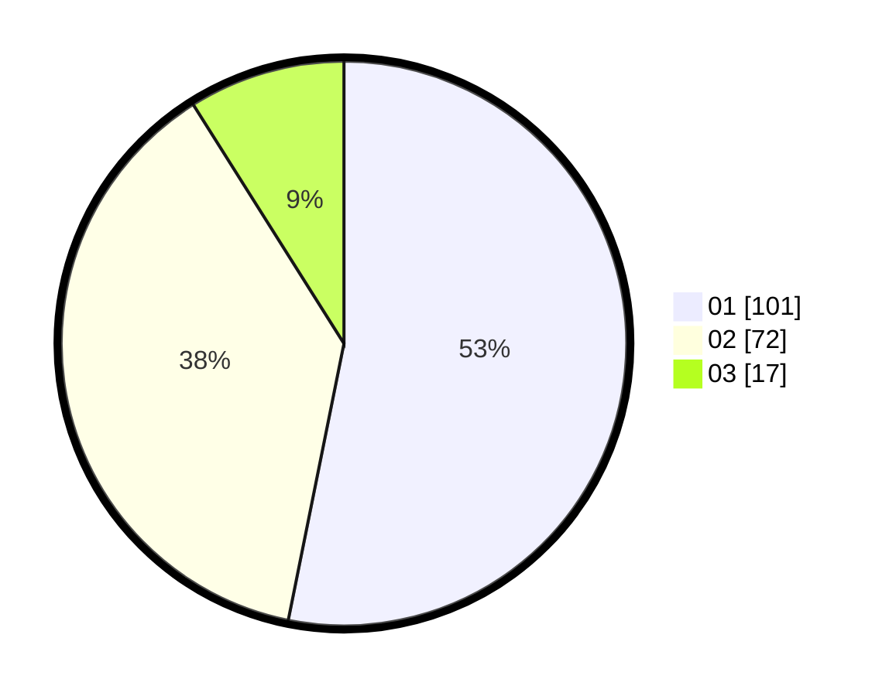

# Hasil

Hasil perolehan suara paslon dapat dilihat pada file paslon-01.txt, paslon-02.txt, dan paslon-03.txt.

Jika tidak ada, artinya data tersebut belum ada pada SIREKAP.

## Perolehan Suara

 * Paslon 01: **101**.
 * Paslon 02: **72**.
 * Paslon 03: **17**.

## Foto C Plano

https://sirekap-obj-formc.kpu.go.id/91d6/pemilu/ppwp/31/75/07/10/03/3175071003201-20240215-003720--07109836-3926-4184-882b-fd98483b5b99.jpg

https://sirekap-obj-formc.kpu.go.id/91d6/pemilu/ppwp/31/75/07/10/03/3175071003201-20240215-003913--06b9d0ac-0240-48d9-8e0b-201076b5d6eb.jpg

https://sirekap-obj-formc.kpu.go.id/91d6/pemilu/ppwp/31/75/07/10/03/3175071003201-20240215-004048--e89d3f10-b812-4c49-81e4-40286df72dfd.jpg

## DATA PEMILIH TETAP

Jumlah pemilih dalam DPT: **260**.
 * L: **132**.
 * P: **128**.

## DATA PENGGUNA HAK PILIH

Jumlah pengguna hak pilih dalam DPT: **192**.
 * L: **96**.
 * P: **96**.

Jumlah pengguna hak pilih dalam DPTb: **1**.
 * L: **1**.
 * P: **0**.

Jumlah pengguna hak pilih dalam DPK: **1**.
 * L: **0**.
 * P: **1**.

Jumlah pengguna hak pilih: **194**.
 * L: **97**.
 * P: **97**.

## JUMLAH SUARA SAH DAN TIDAK SAH

JUMLAH SELURUH SUARA SAH: **190**.

JUMLAH SUARA TIDAK SAH: **4**.

JUMLAH SELURUH SUARA SAH DAN SUARA TIDAK SAH: **194**.
