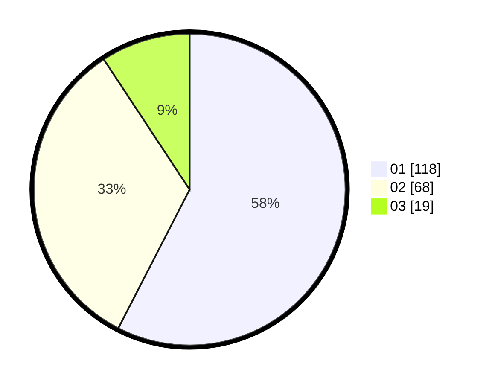

# Hasil

Hasil perolehan suara paslon dapat dilihat pada file paslon-01.txt, paslon-02.txt, dan paslon-03.txt.

Jika tidak ada, artinya data tersebut belum ada pada SIREKAP.

## Perolehan Suara

 * Paslon 01: **118**.
 * Paslon 02: **68**.
 * Paslon 03: **19**.

## Foto C Plano

https://sirekap-obj-formc.kpu.go.id/4c4d/pemilu/ppwp/31/75/07/10/03/3175071003203-20240214-155053--b6f1dd11-8d1b-4be1-9028-23606b84bb4f.jpg

https://sirekap-obj-formc.kpu.go.id/4c4d/pemilu/ppwp/31/75/07/10/03/3175071003203-20240214-155725--7cc478ad-8465-455a-8e07-cabcb93ffa5c.jpg

https://sirekap-obj-formc.kpu.go.id/4c4d/pemilu/ppwp/31/75/07/10/03/3175071003203-20240214-155502--d80198dc-0462-4733-8894-febe5b2ac7c1.jpg

## DATA PEMILIH TETAP

Jumlah pemilih dalam DPT: **266**.
 * L: **121**.
 * P: **145**.

## DATA PENGGUNA HAK PILIH

Jumlah pengguna hak pilih dalam DPT: **204**.
 * L: **93**.
 * P: **111**.

Jumlah pengguna hak pilih dalam DPTb: **0**.
 * L: **0**.
 * P: **0**.

Jumlah pengguna hak pilih dalam DPK: **2**.
 * L: **1**.
 * P: **1**.

Jumlah pengguna hak pilih: **206**.
 * L: **94**.
 * P: **112**.

## JUMLAH SUARA SAH DAN TIDAK SAH

JUMLAH SELURUH SUARA SAH: **205**.

JUMLAH SUARA TIDAK SAH: **1**.

JUMLAH SELURUH SUARA SAH DAN SUARA TIDAK SAH: **206**.
