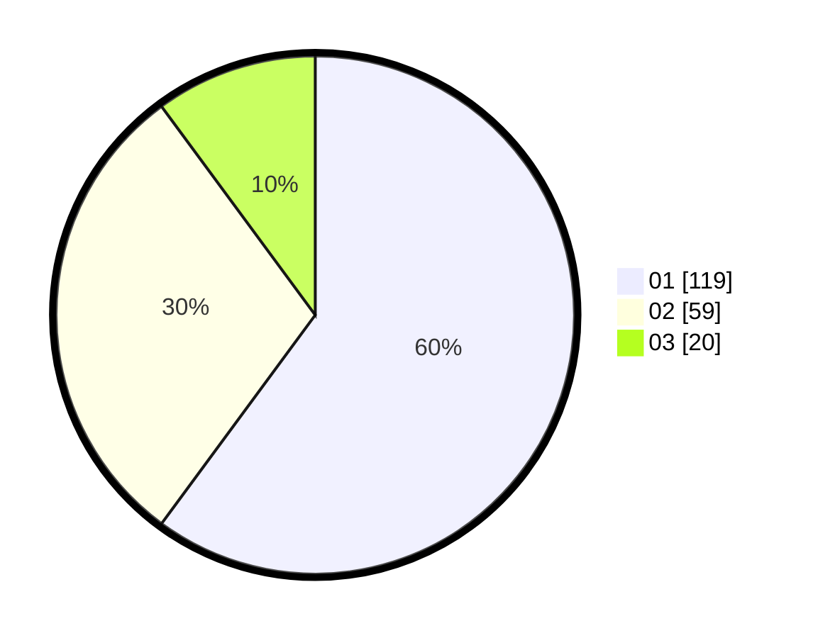

# Hasil

Hasil perolehan suara paslon dapat dilihat pada file paslon-01.txt, paslon-02.txt, dan paslon-03.txt.

Jika tidak ada, artinya data tersebut belum ada pada SIREKAP.

## Perolehan Suara

 * Paslon 01: **119**.
 * Paslon 02: **59**.
 * Paslon 03: **20**.

## Foto C Plano

https://sirekap-obj-formc.kpu.go.id/ab26/pemilu/ppwp/31/75/07/10/03/3175071003206-20240216-074929--d9bb7642-6258-4535-8356-6092c785c62b.jpg

https://sirekap-obj-formc.kpu.go.id/ab26/pemilu/ppwp/31/75/07/10/03/3175071003206-20240216-074931--21466a73-b5b8-4b74-afcf-a76bdbe39bb6.jpg

https://sirekap-obj-formc.kpu.go.id/ab26/pemilu/ppwp/31/75/07/10/03/3175071003206-20240216-074930--7e52a3dd-d352-4f6e-8653-91a2d9146a6c.jpg

## DATA PEMILIH TETAP

Jumlah pemilih dalam DPT: **258**.
 * L: **121**.
 * P: **137**.

## DATA PENGGUNA HAK PILIH

Jumlah pengguna hak pilih dalam DPT: **194**.
 * L: **90**.
 * P: **104**.

Jumlah pengguna hak pilih dalam DPTb: **4**.
 * L: **2**.
 * P: **2**.

Jumlah pengguna hak pilih dalam DPK: **1**.
 * L: **1**.
 * P: **0**.

Jumlah pengguna hak pilih: **199**.
 * L: **93**.
 * P: **106**.

## JUMLAH SUARA SAH DAN TIDAK SAH

JUMLAH SELURUH SUARA SAH: **198**.

JUMLAH SUARA TIDAK SAH: **1**.

JUMLAH SELURUH SUARA SAH DAN SUARA TIDAK SAH: **199**.
