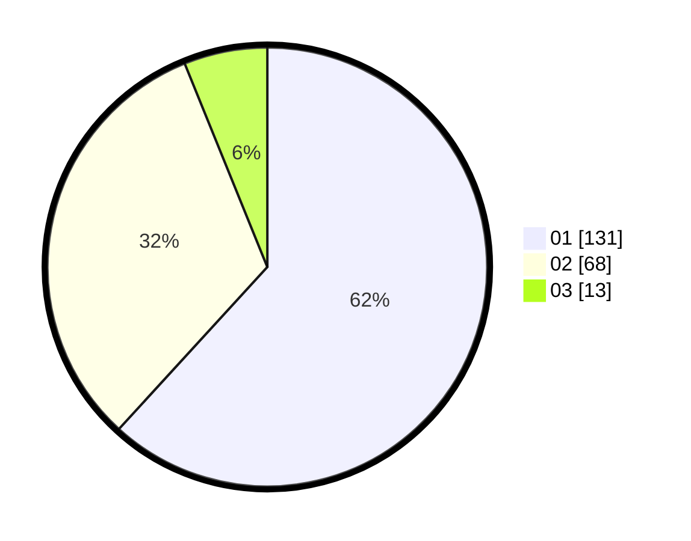

# Hasil

Hasil perolehan suara paslon dapat dilihat pada file paslon-01.txt, paslon-02.txt, dan paslon-03.txt.

Jika tidak ada, artinya data tersebut belum ada pada SIREKAP.

## Perolehan Suara

 * Paslon 01: **131**.
 * Paslon 02: **68**.
 * Paslon 03: **13**.

## Foto C Plano

https://sirekap-obj-formc.kpu.go.id/a5bf/pemilu/ppwp/31/75/07/10/03/3175071003210-20240216-134702--1196df45-57b7-46f5-ba48-0ae8da184028.jpg

https://sirekap-obj-formc.kpu.go.id/a5bf/pemilu/ppwp/31/75/07/10/03/3175071003210-20240216-134703--550cc4fb-758e-4d90-9b69-b98167752635.jpg

https://sirekap-obj-formc.kpu.go.id/a5bf/pemilu/ppwp/31/75/07/10/03/3175071003210-20240216-134702--69b9c201-3a99-4557-91e0-a68bb53a9f55.jpg

## DATA PEMILIH TETAP

Jumlah pemilih dalam DPT: **262**.
 * L: **138**.
 * P: **124**.

## DATA PENGGUNA HAK PILIH

Jumlah pengguna hak pilih dalam DPT: **214**.
 * L: **110**.
 * P: **104**.

Jumlah pengguna hak pilih dalam DPTb: **0**.
 * L: **0**.
 * P: **0**.

Jumlah pengguna hak pilih dalam DPK: **1**.
 * L: **0**.
 * P: **1**.

Jumlah pengguna hak pilih: **215**.
 * L: **110**.
 * P: **105**.

## JUMLAH SUARA SAH DAN TIDAK SAH

JUMLAH SELURUH SUARA SAH: **212**.

JUMLAH SUARA TIDAK SAH: **3**.

JUMLAH SELURUH SUARA SAH DAN SUARA TIDAK SAH: **215**.
