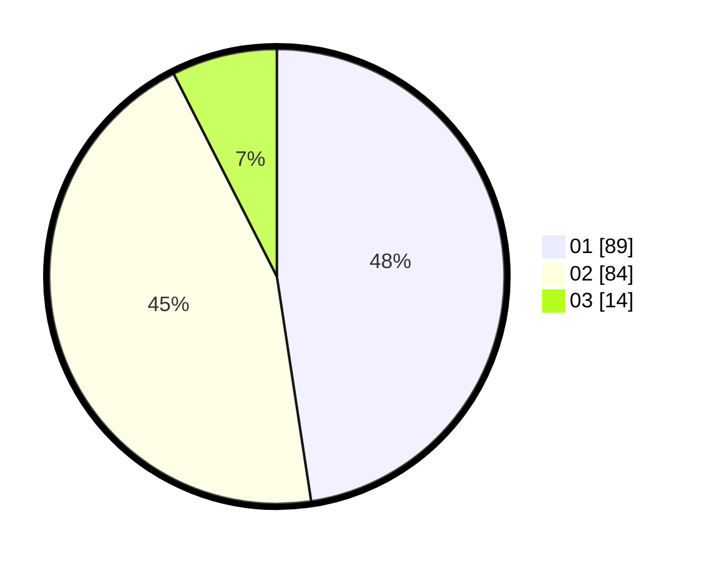

# Hasil

Hasil perolehan suara paslon dapat dilihat pada file paslon-01.txt, paslon-02.txt, dan paslon-03.txt.

Jika tidak ada, artinya data tersebut belum ada pada SIREKAP.

## Perolehan Suara

 * Paslon 01: **89**.
 * Paslon 02: **84**.
 * Paslon 03: **14**.

## Foto C Plano

https://sirekap-obj-formc.kpu.go.id/3a63/pemilu/ppwp/31/75/07/10/03/3175071003215-20240218-203244--07823fe8-4ef4-4372-8534-d4268577e9ae.jpg

https://sirekap-obj-formc.kpu.go.id/3a63/pemilu/ppwp/31/75/07/10/03/3175071003215-20240218-204210--f759f6c2-59cd-4e7b-b5ff-1eb18c7dcb62.jpg

https://sirekap-obj-formc.kpu.go.id/3a63/pemilu/ppwp/31/75/07/10/03/3175071003215-20240218-204610--34ea516d-3a73-4d88-aa35-f0bdbcd22573.jpg

## DATA PEMILIH TETAP

Jumlah pemilih dalam DPT: **260**.
 * L: **129**.
 * P: **131**.

## DATA PENGGUNA HAK PILIH

Jumlah pengguna hak pilih dalam DPT: **187**.
 * L: **89**.
 * P: **98**.

Jumlah pengguna hak pilih dalam DPTb: **0**.
 * L: **0**.
 * P: **0**.

Jumlah pengguna hak pilih dalam DPK: **0**.
 * L: **0**.
 * P: **0**.

Jumlah pengguna hak pilih: **187**.
 * L: **89**.
 * P: **98**.

## JUMLAH SUARA SAH DAN TIDAK SAH

JUMLAH SELURUH SUARA SAH: **187**.

JUMLAH SUARA TIDAK SAH: **0**.

JUMLAH SELURUH SUARA SAH DAN SUARA TIDAK SAH: **187**.
