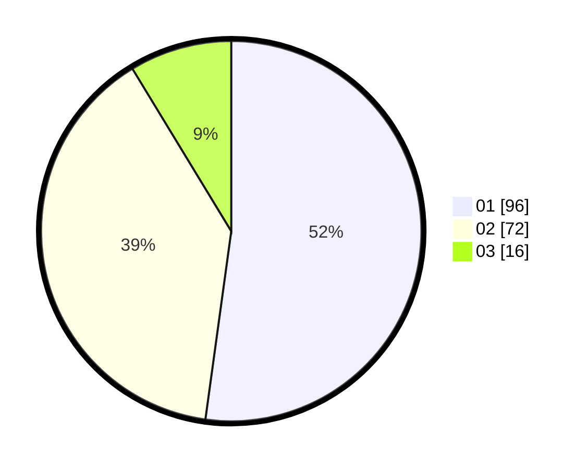

# Hasil

Hasil perolehan suara paslon dapat dilihat pada file paslon-01.txt, paslon-02.txt, dan paslon-03.txt.

Jika tidak ada, artinya data tersebut belum ada pada SIREKAP.

## Perolehan Suara

 * Paslon 01: **96**.
 * Paslon 02: **72**.
 * Paslon 03: **16**.

## Foto C Plano

https://sirekap-obj-formc.kpu.go.id/a923/pemilu/ppwp/31/75/07/10/03/3175071003216-20240216-083659--4ba37328-f6db-4b5d-ad12-bc29fa8ba8ae.jpg

https://sirekap-obj-formc.kpu.go.id/a923/pemilu/ppwp/31/75/07/10/03/3175071003216-20240216-083701--25299689-201f-4fcf-8214-f70e78d67ae3.jpg

https://sirekap-obj-formc.kpu.go.id/a923/pemilu/ppwp/31/75/07/10/03/3175071003216-20240216-083700--7369bf3b-67d2-41fc-809d-ef613fc0bb6f.jpg

## DATA PEMILIH TETAP

Jumlah pemilih dalam DPT: **260**.
 * L: **140**.
 * P: **120**.

## DATA PENGGUNA HAK PILIH

Jumlah pengguna hak pilih dalam DPT: **183**.
 * L: **103**.
 * P: **80**.

Jumlah pengguna hak pilih dalam DPTb: **0**.
 * L: **0**.
 * P: **0**.

Jumlah pengguna hak pilih dalam DPK: **6**.
 * L: **4**.
 * P: **2**.

Jumlah pengguna hak pilih: **189**.
 * L: **107**.
 * P: **82**.

## JUMLAH SUARA SAH DAN TIDAK SAH

JUMLAH SELURUH SUARA SAH: **184**.

JUMLAH SUARA TIDAK SAH: **5**.

JUMLAH SELURUH SUARA SAH DAN SUARA TIDAK SAH: **189**.
