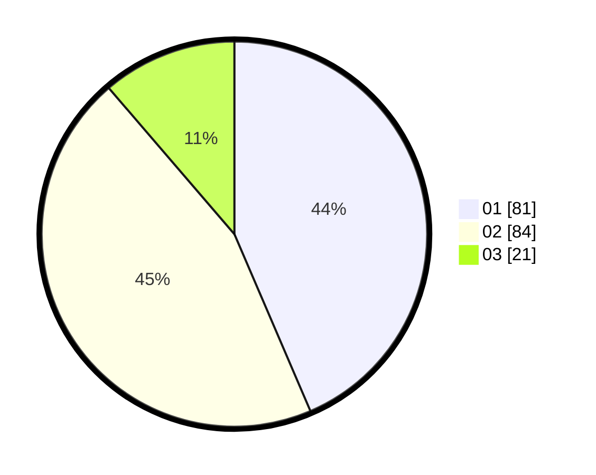

# Hasil

Hasil perolehan suara paslon dapat dilihat pada file paslon-01.txt, paslon-02.txt, dan paslon-03.txt.

Jika tidak ada, artinya data tersebut belum ada pada SIREKAP.

## Perolehan Suara

 * Paslon 01: **81**.
 * Paslon 02: **84**.
 * Paslon 03: **21**.

## Foto C Plano

https://sirekap-obj-formc.kpu.go.id/a5a1/pemilu/ppwp/31/75/07/10/03/3175071003219-20240216-122607--4dd1415e-41b8-4c1a-af97-ac32aaf3c1e2.jpg

https://sirekap-obj-formc.kpu.go.id/a5a1/pemilu/ppwp/31/75/07/10/03/3175071003219-20240216-122608--ad9bc073-2200-4627-8220-f9345445f0a7.jpg

https://sirekap-obj-formc.kpu.go.id/a5a1/pemilu/ppwp/31/75/07/10/03/3175071003219-20240216-122608--44c81600-e729-4240-8171-9a85b452a539.jpg

## DATA PEMILIH TETAP

Jumlah pemilih dalam DPT: **259**.
 * L: **136**.
 * P: **123**.

## DATA PENGGUNA HAK PILIH

Jumlah pengguna hak pilih dalam DPT: **187**.
 * L: **107**.
 * P: **80**.

Jumlah pengguna hak pilih dalam DPTb: **1**.
 * L: **1**.
 * P: **0**.

Jumlah pengguna hak pilih dalam DPK: **1**.
 * L: **0**.
 * P: **1**.

Jumlah pengguna hak pilih: **189**.
 * L: **108**.
 * P: **81**.

## JUMLAH SUARA SAH DAN TIDAK SAH

JUMLAH SELURUH SUARA SAH: **186**.

JUMLAH SUARA TIDAK SAH: **3**.

JUMLAH SELURUH SUARA SAH DAN SUARA TIDAK SAH: **189**.
