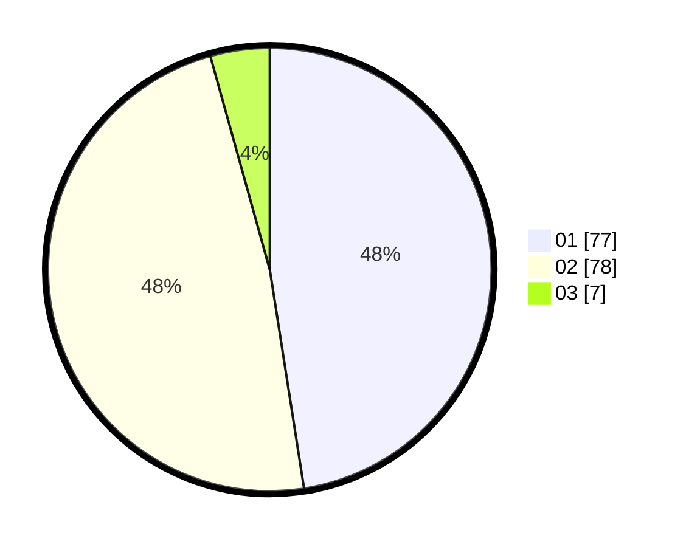

# Hasil

Hasil perolehan suara paslon dapat dilihat pada file paslon-01.txt, paslon-02.txt, dan paslon-03.txt.

Jika tidak ada, artinya data tersebut belum ada pada SIREKAP.

## Perolehan Suara

 * Paslon 01: **77**.
 * Paslon 02: **78**.
 * Paslon 03: **7**.

## Foto C Plano

https://sirekap-obj-formc.kpu.go.id/ed94/pemilu/ppwp/31/75/07/10/03/3175071003220-20240215-011215--e0c7d58f-7bed-4672-9d38-0d9dba65c7b5.jpg

https://sirekap-obj-formc.kpu.go.id/ed94/pemilu/ppwp/31/75/07/10/03/3175071003220-20240215-011405--b617bd03-8ef3-4bc2-a4d2-2491372b6b27.jpg

https://sirekap-obj-formc.kpu.go.id/ed94/pemilu/ppwp/31/75/07/10/03/3175071003220-20240215-011540--c4b9d2a9-9a46-4a0a-9c94-18473d1ce982.jpg
