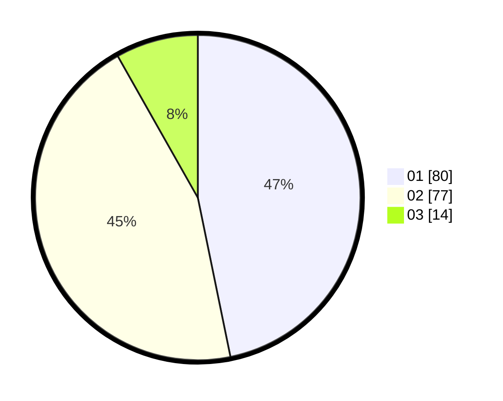

# Hasil

Hasil perolehan suara paslon dapat dilihat pada file paslon-01.txt, paslon-02.txt, dan paslon-03.txt.

Jika tidak ada, artinya data tersebut belum ada pada SIREKAP.

## Perolehan Suara

 * Paslon 01: **80**.
 * Paslon 02: **77**.
 * Paslon 03: **14**.

## Foto C Plano

https://sirekap-obj-formc.kpu.go.id/af30/pemilu/ppwp/31/75/07/10/03/3175071003221-20240214-230035--8fbc12f5-54db-43f2-8100-abed080ed7c2.jpg

https://sirekap-obj-formc.kpu.go.id/af30/pemilu/ppwp/31/75/07/10/03/3175071003221-20240214-230122--68bf864e-4f36-4b51-8514-404ddbffc07f.jpg

https://sirekap-obj-formc.kpu.go.id/af30/pemilu/ppwp/31/75/07/10/03/3175071003221-20240214-230216--8e364ef0-5864-4e09-946f-19ad790c9591.jpg

## DATA PEMILIH TETAP

Jumlah pemilih dalam DPT: **263**.
 * L: **136**.
 * P: **127**.

## DATA PENGGUNA HAK PILIH

Jumlah pengguna hak pilih dalam DPT: **167**.
 * L: **80**.
 * P: **87**.

Jumlah pengguna hak pilih dalam DPTb: **3**.
 * L: **2**.
 * P: **1**.

Jumlah pengguna hak pilih dalam DPK: **1**.
 * L: **0**.
 * P: **1**.

Jumlah pengguna hak pilih: **171**.
 * L: **82**.
 * P: **89**.

## JUMLAH SUARA SAH DAN TIDAK SAH

JUMLAH SELURUH SUARA SAH: **171**.

JUMLAH SUARA TIDAK SAH: **0**.

JUMLAH SELURUH SUARA SAH DAN SUARA TIDAK SAH: **171**.
