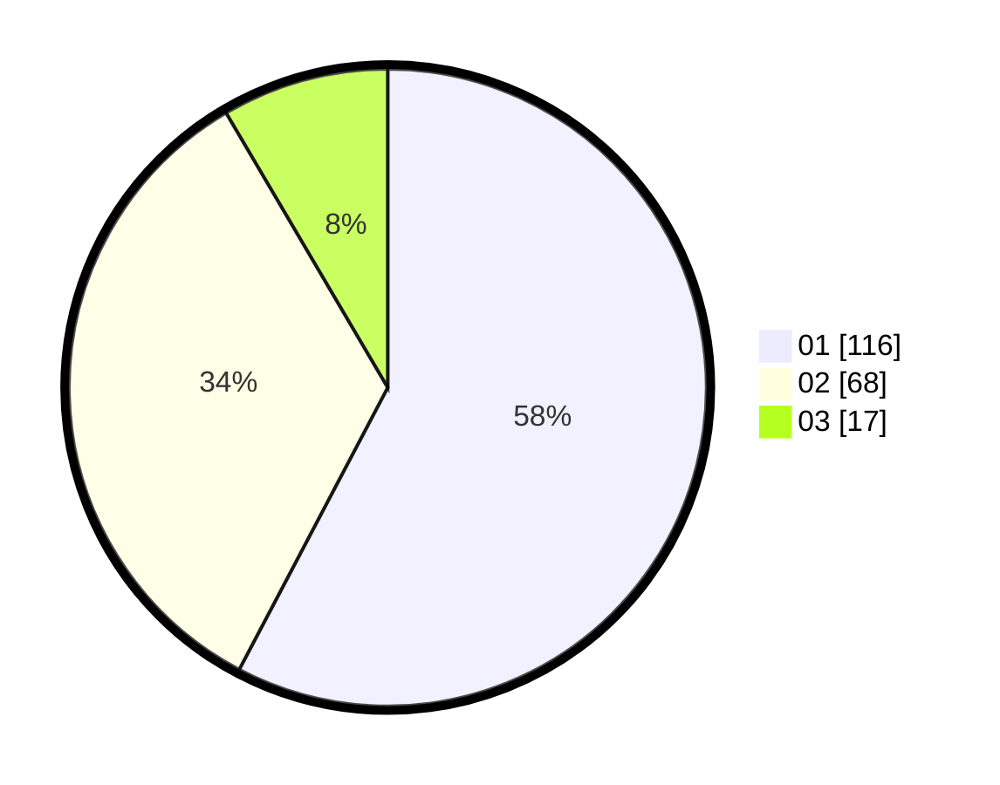

# Hasil

Hasil perolehan suara paslon dapat dilihat pada file paslon-01.txt, paslon-02.txt, dan paslon-03.txt.

Jika tidak ada, artinya data tersebut belum ada pada SIREKAP.

## Perolehan Suara

 * Paslon 01: **116**.
 * Paslon 02: **68**.
 * Paslon 03: **17**.

## Foto C Plano

https://sirekap-obj-formc.kpu.go.id/a732/pemilu/ppwp/31/75/07/10/03/3175071003225-20240214-180520--7e574bc9-9f2c-4dee-ba9c-9760752acac4.jpg

https://sirekap-obj-formc.kpu.go.id/a732/pemilu/ppwp/31/75/07/10/03/3175071003225-20240214-182020--c15d81f5-b1bf-4b4b-9fdc-24b1bdbddd34.jpg

https://sirekap-obj-formc.kpu.go.id/a732/pemilu/ppwp/31/75/07/10/03/3175071003225-20240214-183252--e399f0e7-f090-4351-a025-6f5da8caf4d7.jpg

## DATA PEMILIH TETAP

Jumlah pemilih dalam DPT: **260**.
 * L: **118**.
 * P: **142**.

## DATA PENGGUNA HAK PILIH

Jumlah pengguna hak pilih dalam DPT: **199**.
 * L: **87**.
 * P: **112**.

Jumlah pengguna hak pilih dalam DPTb: **3**.
 * L: **1**.
 * P: **2**.

Jumlah pengguna hak pilih dalam DPK: **1**.
 * L: **1**.
 * P: **0**.

Jumlah pengguna hak pilih: **203**.
 * L: **89**.
 * P: **114**.

## JUMLAH SUARA SAH DAN TIDAK SAH

JUMLAH SELURUH SUARA SAH: **201**.

JUMLAH SUARA TIDAK SAH: **2**.

JUMLAH SELURUH SUARA SAH DAN SUARA TIDAK SAH: **203**.
