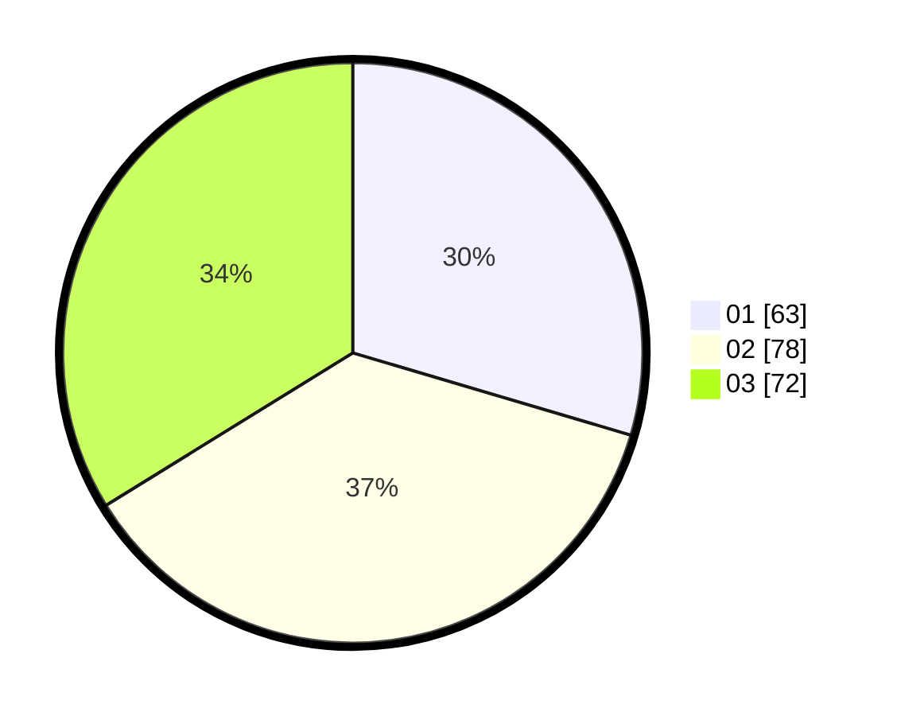

# Hasil

Hasil perolehan suara paslon dapat dilihat pada file paslon-01.txt, paslon-02.txt, dan paslon-03.txt.

Jika tidak ada, artinya data tersebut belum ada pada SIREKAP.

## Perolehan Suara

 * Paslon 01: **63**.
 * Paslon 02: **78**.
 * Paslon 03: **72**.

## Foto C Plano

https://sirekap-obj-formc.kpu.go.id/4a35/pemilu/ppwp/31/75/07/10/03/3175071003238-20240214-204712--1730ebaa-cbed-4859-a55d-f51270f21e17.jpg

https://sirekap-obj-formc.kpu.go.id/4a35/pemilu/ppwp/31/75/07/10/03/3175071003238-20240214-205831--9c801735-776f-417a-941b-c4a19dfa1673.jpg

https://sirekap-obj-formc.kpu.go.id/4a35/pemilu/ppwp/31/75/07/10/03/3175071003238-20240214-205951--548550f3-e09e-4efe-8f99-887311d7a894.jpg
