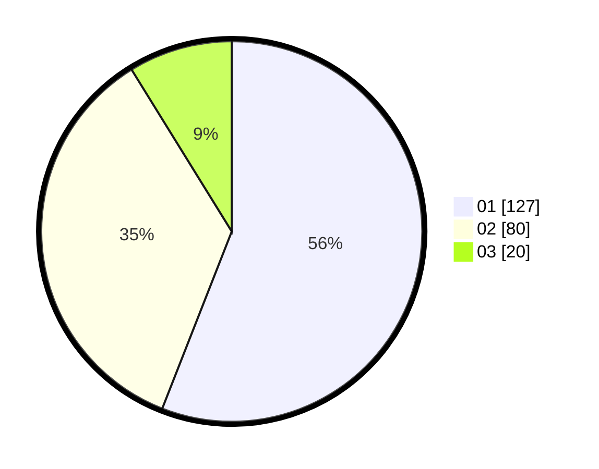

# Hasil

Hasil perolehan suara paslon dapat dilihat pada file paslon-01.txt, paslon-02.txt, dan paslon-03.txt.

Jika tidak ada, artinya data tersebut belum ada pada SIREKAP.

## Perolehan Suara

 * Paslon 01: **127**.
 * Paslon 02: **80**.
 * Paslon 03: **20**.

## Foto C Plano

https://sirekap-obj-formc.kpu.go.id/dff6/pemilu/ppwp/31/75/07/10/04/3175071004002-20240214-155052--990724bf-6ff0-4f90-87d8-913182d371cb.jpg

https://sirekap-obj-formc.kpu.go.id/dff6/pemilu/ppwp/31/75/07/10/04/3175071004002-20240214-155125--14541076-5563-4941-b75a-e076c0a2453f.jpg

https://sirekap-obj-formc.kpu.go.id/dff6/pemilu/ppwp/31/75/07/10/04/3175071004002-20240214-155143--105480dd-396c-4da3-ba79-267d4acdee9f.jpg

## DATA PEMILIH TETAP

Jumlah pemilih dalam DPT: **268**.
 * L: **136**.
 * P: **132**.

## DATA PENGGUNA HAK PILIH

Jumlah pengguna hak pilih dalam DPT: **220**.
 * L: **107**.
 * P: **113**.

Jumlah pengguna hak pilih dalam DPTb: **6**.
 * L: **5**.
 * P: **1**.

Jumlah pengguna hak pilih dalam DPK: **1**.
 * L: **1**.
 * P: **0**.

Jumlah pengguna hak pilih: **227**.
 * L: **113**.
 * P: **114**.

## JUMLAH SUARA SAH DAN TIDAK SAH

JUMLAH SELURUH SUARA SAH: **227**.

JUMLAH SUARA TIDAK SAH: **0**.

JUMLAH SELURUH SUARA SAH DAN SUARA TIDAK SAH: **227**.
