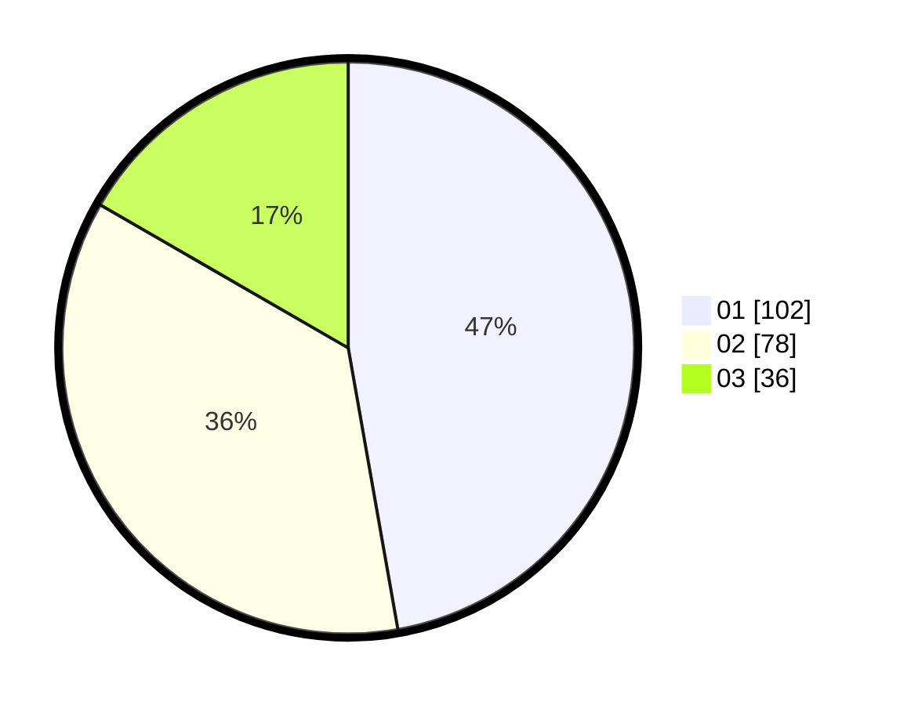

# Hasil

Hasil perolehan suara paslon dapat dilihat pada file paslon-01.txt, paslon-02.txt, dan paslon-03.txt.

Jika tidak ada, artinya data tersebut belum ada pada SIREKAP.

## Perolehan Suara

 * Paslon 01: **102**.
 * Paslon 02: **78**.
 * Paslon 03: **36**.

## Foto C Plano

https://sirekap-obj-formc.kpu.go.id/f430/pemilu/ppwp/31/75/07/10/04/3175071004003-20240214-201934--7c29aac8-7aa1-4ec7-9588-458d7d8577fa.jpg

https://sirekap-obj-formc.kpu.go.id/f430/pemilu/ppwp/31/75/07/10/04/3175071004003-20240214-202128--0b38afc0-6ce5-443e-8415-24f8e3c8b518.jpg

https://sirekap-obj-formc.kpu.go.id/f430/pemilu/ppwp/31/75/07/10/04/3175071004003-20240214-202322--c3443b2d-8b5d-4f08-bad1-035cef1f60ab.jpg
