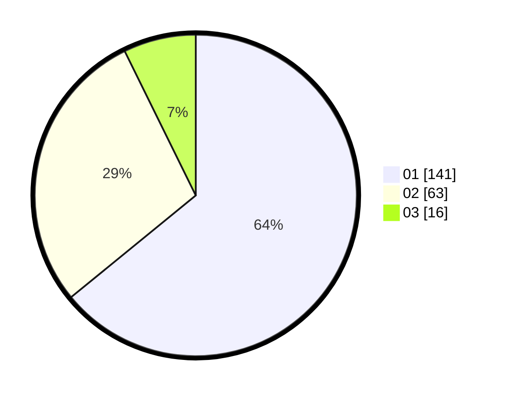

# Hasil

Hasil perolehan suara paslon dapat dilihat pada file paslon-01.txt, paslon-02.txt, dan paslon-03.txt.

Jika tidak ada, artinya data tersebut belum ada pada SIREKAP.

## Perolehan Suara

 * Paslon 01: **141**.
 * Paslon 02: **63**.
 * Paslon 03: **16**.

## Foto C Plano

https://sirekap-obj-formc.kpu.go.id/8292/pemilu/ppwp/31/75/07/10/04/3175071004005-20240214-155345--4682c22c-5c2b-40e8-8b34-bb81cc695751.jpg

https://sirekap-obj-formc.kpu.go.id/8292/pemilu/ppwp/31/75/07/10/04/3175071004005-20240214-232316--dffd3e3d-c363-4b8a-9608-97ff21c0ae60.jpg

https://sirekap-obj-formc.kpu.go.id/8292/pemilu/ppwp/31/75/07/10/04/3175071004005-20240214-155353--8829c9bc-d55c-4715-841a-b93107f6591d.jpg

## DATA PEMILIH TETAP

Jumlah pemilih dalam DPT: **267**.
 * L: **126**.
 * P: **141**.

## DATA PENGGUNA HAK PILIH

Jumlah pengguna hak pilih dalam DPT: **222**.
 * L: **101**.
 * P: **121**.

Jumlah pengguna hak pilih dalam DPTb: **0**.
 * L: **0**.
 * P: **0**.

Jumlah pengguna hak pilih dalam DPK: **0**.
 * L: **0**.
 * P: **0**.

Jumlah pengguna hak pilih: **222**.
 * L: **101**.
 * P: **121**.

## JUMLAH SUARA SAH DAN TIDAK SAH

JUMLAH SELURUH SUARA SAH: **220**.

JUMLAH SUARA TIDAK SAH: **2**.

JUMLAH SELURUH SUARA SAH DAN SUARA TIDAK SAH: **222**.
