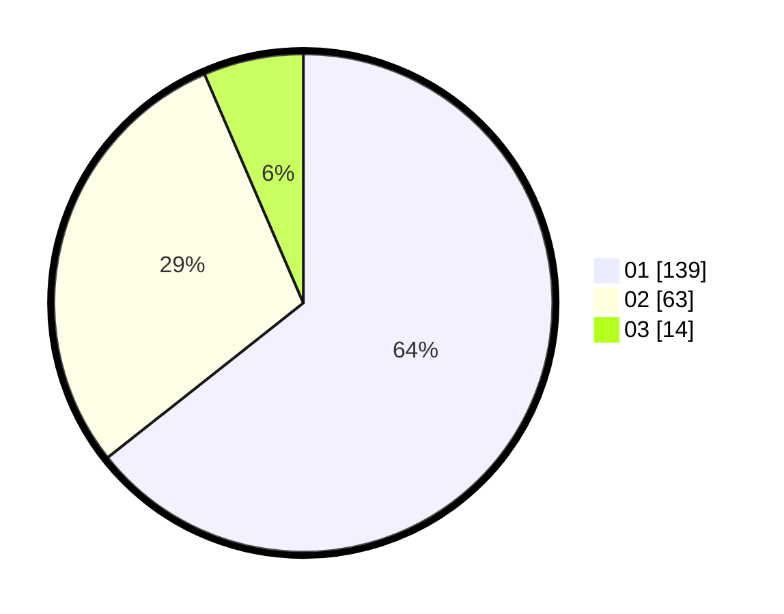

# Hasil

Hasil perolehan suara paslon dapat dilihat pada file paslon-01.txt, paslon-02.txt, dan paslon-03.txt.

Jika tidak ada, artinya data tersebut belum ada pada SIREKAP.

## Perolehan Suara

 * Paslon 01: **139**.
 * Paslon 02: **63**.
 * Paslon 03: **14**.

## Foto C Plano

https://sirekap-obj-formc.kpu.go.id/3259/pemilu/ppwp/31/75/07/10/04/3175071004006-20240214-204139--9108c59a-e8ab-40e6-afac-c995a1533f0f.jpg

https://sirekap-obj-formc.kpu.go.id/3259/pemilu/ppwp/31/75/07/10/04/3175071004006-20240214-204157--73c34347-666e-48de-9768-77feac5e22dc.jpg

https://sirekap-obj-formc.kpu.go.id/3259/pemilu/ppwp/31/75/07/10/04/3175071004006-20240214-204227--7f03440f-0538-45f2-bf74-0b10c45c6686.jpg

## DATA PEMILIH TETAP

Jumlah pemilih dalam DPT: **259**.
 * L: **130**.
 * P: **129**.

## DATA PENGGUNA HAK PILIH

Jumlah pengguna hak pilih dalam DPT: **220**.
 * L: **105**.
 * P: **115**.

Jumlah pengguna hak pilih dalam DPTb: **0**.
 * L: **0**.
 * P: **0**.

Jumlah pengguna hak pilih dalam DPK: **0**.
 * L: **0**.
 * P: **0**.

Jumlah pengguna hak pilih: **220**.
 * L: **105**.
 * P: **115**.

## JUMLAH SUARA SAH DAN TIDAK SAH

JUMLAH SELURUH SUARA SAH: **216**.

JUMLAH SUARA TIDAK SAH: **4**.

JUMLAH SELURUH SUARA SAH DAN SUARA TIDAK SAH: **220**.
