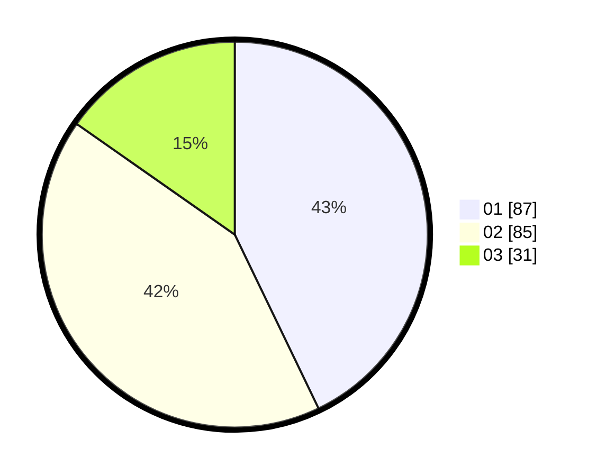

# Hasil

Hasil perolehan suara paslon dapat dilihat pada file paslon-01.txt, paslon-02.txt, dan paslon-03.txt.

Jika tidak ada, artinya data tersebut belum ada pada SIREKAP.

## Perolehan Suara

 * Paslon 01: **87**.
 * Paslon 02: **85**.
 * Paslon 03: **31**.

## Foto C Plano

https://sirekap-obj-formc.kpu.go.id/f9e2/pemilu/ppwp/31/75/07/10/04/3175071004013-20240215-004413--4cb1601b-91cc-4184-86bf-b2185317d31e.jpg

https://sirekap-obj-formc.kpu.go.id/f9e2/pemilu/ppwp/31/75/07/10/04/3175071004013-20240215-004507--8bf050ec-02b9-4ba1-aefc-6c62c150bf69.jpg

https://sirekap-obj-formc.kpu.go.id/f9e2/pemilu/ppwp/31/75/07/10/04/3175071004013-20240215-004626--f3b21386-7cc1-453c-9443-a7e2da0bc9ce.jpg
