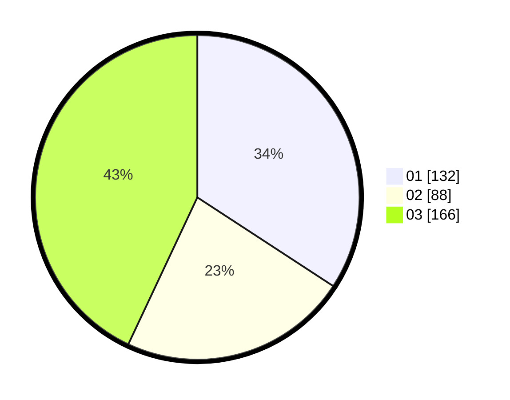

# Hasil

Hasil perolehan suara paslon dapat dilihat pada file paslon-01.txt, paslon-02.txt, dan paslon-03.txt.

Jika tidak ada, artinya data tersebut belum ada pada SIREKAP.

## Perolehan Suara

 * Paslon 01: **132**.
 * Paslon 02: **88**.
 * Paslon 03: **166**.

## Foto C Plano

https://sirekap-obj-formc.kpu.go.id/3f32/pemilu/ppwp/31/75/07/10/04/3175071004018-20240214-194232--fca4c3ef-9b6c-4f36-94bb-524952c70564.jpg

https://sirekap-obj-formc.kpu.go.id/3f32/pemilu/ppwp/31/75/07/10/04/3175071004018-20240214-194338--b40f5ef6-346b-4ead-9d70-60842d6dbb30.jpg

https://sirekap-obj-formc.kpu.go.id/3f32/pemilu/ppwp/31/75/07/10/04/3175071004018-20240214-194433--5af29821-ef90-45b5-82c4-ad0d5c91caa3.jpg
