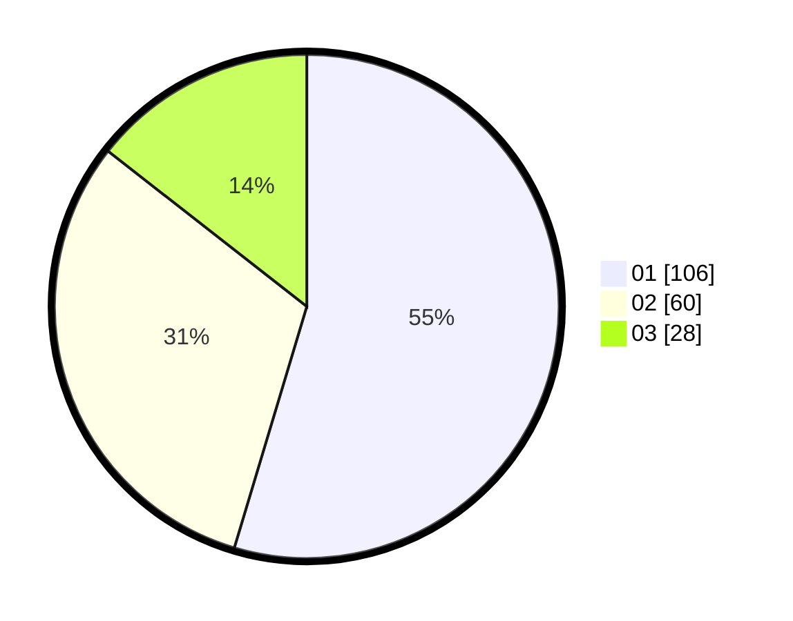

# Hasil

Hasil perolehan suara paslon dapat dilihat pada file paslon-01.txt, paslon-02.txt, dan paslon-03.txt.

Jika tidak ada, artinya data tersebut belum ada pada SIREKAP.

## Perolehan Suara

 * Paslon 01: **106**.
 * Paslon 02: **60**.
 * Paslon 03: **28**.

## Foto C Plano

https://sirekap-obj-formc.kpu.go.id/1546/pemilu/ppwp/31/75/07/10/04/3175071004023-20240216-013913--06086b78-71c5-4590-b38c-fc8b8dd4919b.jpg

https://sirekap-obj-formc.kpu.go.id/1546/pemilu/ppwp/31/75/07/10/04/3175071004023-20240216-024444--5d21e12a-b3f1-4276-acfc-a76857cfceca.jpg

https://sirekap-obj-formc.kpu.go.id/1546/pemilu/ppwp/31/75/07/10/04/3175071004023-20240216-013923--4da481db-501a-4b77-b068-2dce491428c8.jpg

## DATA PEMILIH TETAP

Jumlah pemilih dalam DPT: **259**.
 * L: **127**.
 * P: **132**.

## DATA PENGGUNA HAK PILIH

Jumlah pengguna hak pilih dalam DPT: **196**.
 * L: **93**.
 * P: **103**.

Jumlah pengguna hak pilih dalam DPTb: **2**.
 * L: **1**.
 * P: **1**.

Jumlah pengguna hak pilih dalam DPK: **0**.
 * L: **0**.
 * P: **0**.

Jumlah pengguna hak pilih: **198**.
 * L: **94**.
 * P: **104**.

## JUMLAH SUARA SAH DAN TIDAK SAH

JUMLAH SELURUH SUARA SAH: **194**.

JUMLAH SUARA TIDAK SAH: **4**.

JUMLAH SELURUH SUARA SAH DAN SUARA TIDAK SAH: **198**.
