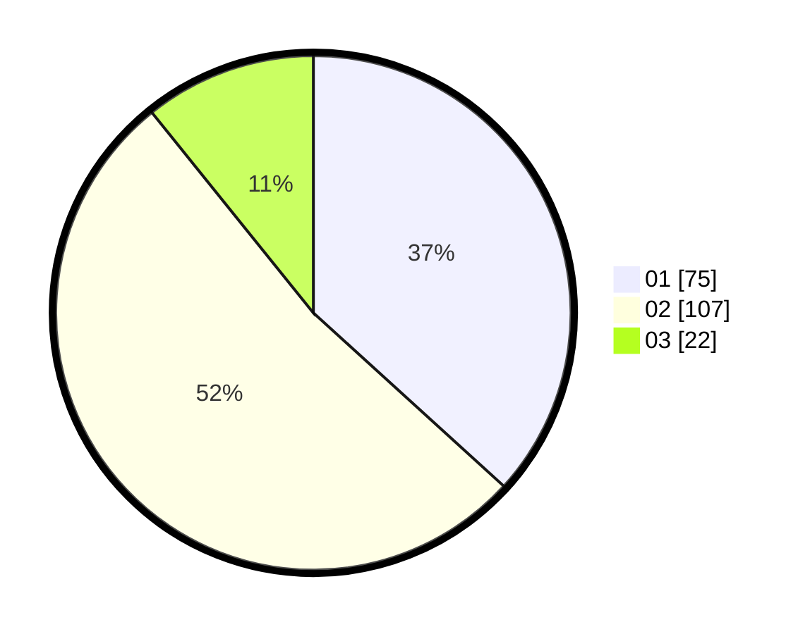

# Hasil

Hasil perolehan suara paslon dapat dilihat pada file paslon-01.txt, paslon-02.txt, dan paslon-03.txt.

Jika tidak ada, artinya data tersebut belum ada pada SIREKAP.

## Perolehan Suara

 * Paslon 01: **75**.
 * Paslon 02: **107**.
 * Paslon 03: **22**.

## Foto C Plano

https://sirekap-obj-formc.kpu.go.id/fe6c/pemilu/ppwp/31/75/07/10/04/3175071004035-20240215-010150--376273aa-fc06-40f5-ac00-9a626fe4ac09.jpg

https://sirekap-obj-formc.kpu.go.id/fe6c/pemilu/ppwp/31/75/07/10/04/3175071004035-20240215-010247--9b40b04c-a2f2-4680-8155-272b987a895a.jpg

https://sirekap-obj-formc.kpu.go.id/fe6c/pemilu/ppwp/31/75/07/10/04/3175071004035-20240215-010349--b2db6ae8-3413-4994-93ef-df60c4ffaa23.jpg

## DATA PEMILIH TETAP

Jumlah pemilih dalam DPT: **242**.
 * L: **120**.
 * P: **122**.

## DATA PENGGUNA HAK PILIH

Jumlah pengguna hak pilih dalam DPT: **195**.
 * L: **98**.
 * P: **97**.

Jumlah pengguna hak pilih dalam DPTb: **4**.
 * L: **1**.
 * P: **3**.

Jumlah pengguna hak pilih dalam DPK: **6**.
 * L: **2**.
 * P: **4**.

Jumlah pengguna hak pilih: **205**.
 * L: **101**.
 * P: **104**.

## JUMLAH SUARA SAH DAN TIDAK SAH

JUMLAH SELURUH SUARA SAH: **204**.

JUMLAH SUARA TIDAK SAH: **1**.

JUMLAH SELURUH SUARA SAH DAN SUARA TIDAK SAH: **205**.
