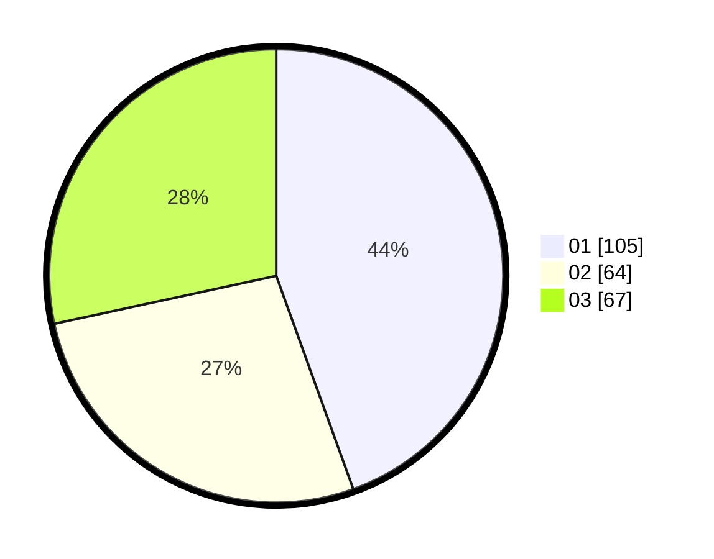

# Hasil

Hasil perolehan suara paslon dapat dilihat pada file paslon-01.txt, paslon-02.txt, dan paslon-03.txt.

Jika tidak ada, artinya data tersebut belum ada pada SIREKAP.

## Perolehan Suara

 * Paslon 01: **105**.
 * Paslon 02: **64**.
 * Paslon 03: **67**.

## Foto C Plano

https://sirekap-obj-formc.kpu.go.id/b5d7/pemilu/ppwp/31/75/07/10/04/3175071004038-20240214-194945--62d5d925-18f6-4f30-b61d-1e09ac13024e.jpg

https://sirekap-obj-formc.kpu.go.id/b5d7/pemilu/ppwp/31/75/07/10/04/3175071004038-20240216-094148--b7693c06-236f-404d-b696-724db8dd4cb8.jpg

https://sirekap-obj-formc.kpu.go.id/b5d7/pemilu/ppwp/31/75/07/10/04/3175071004038-20240216-093524--ac9dcecf-b651-4e21-948a-2e98c4d94508.jpg

## DATA PEMILIH TETAP

Jumlah pemilih dalam DPT: **273**.
 * L: **128**.
 * P: **145**.

## DATA PENGGUNA HAK PILIH

Jumlah pengguna hak pilih dalam DPT: **229**.
 * L: **101**.
 * P: **128**.

Jumlah pengguna hak pilih dalam DPTb: **3**.
 * L: **2**.
 * P: **1**.

Jumlah pengguna hak pilih dalam DPK: **8**.
 * L: **4**.
 * P: **4**.

Jumlah pengguna hak pilih: **240**.
 * L: **107**.
 * P: **133**.

## JUMLAH SUARA SAH DAN TIDAK SAH

JUMLAH SELURUH SUARA SAH: **236**.

JUMLAH SUARA TIDAK SAH: **4**.

JUMLAH SELURUH SUARA SAH DAN SUARA TIDAK SAH: **240**.
