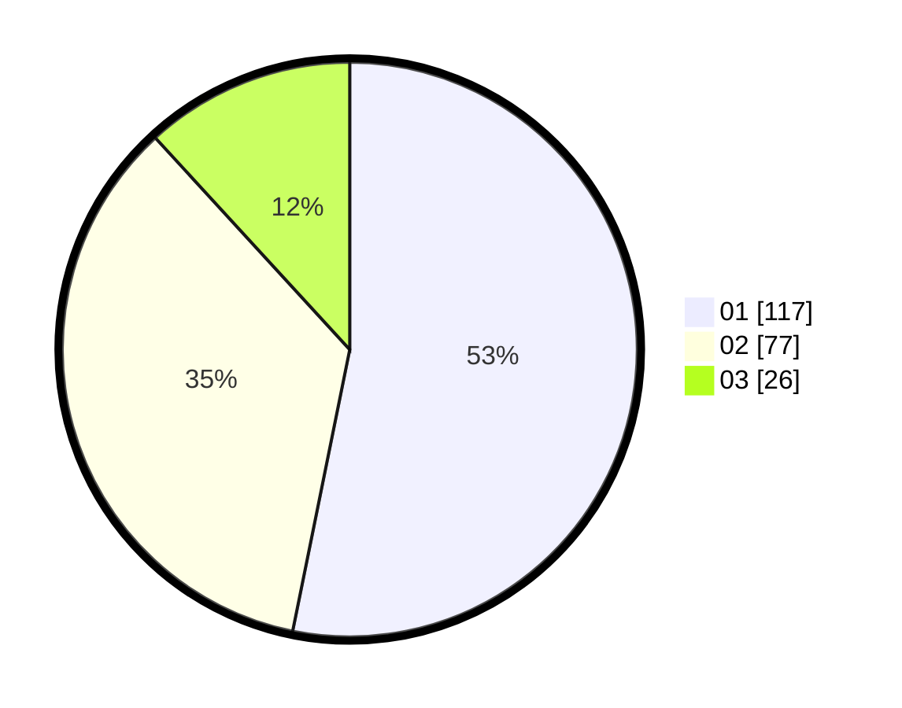

# Hasil

Hasil perolehan suara paslon dapat dilihat pada file paslon-01.txt, paslon-02.txt, dan paslon-03.txt.

Jika tidak ada, artinya data tersebut belum ada pada SIREKAP.

## Perolehan Suara

 * Paslon 01: **117**.
 * Paslon 02: **77**.
 * Paslon 03: **26**.

## Foto C Plano

https://sirekap-obj-formc.kpu.go.id/c67e/pemilu/ppwp/31/75/07/10/04/3175071004040-20240216-053251--7bb11320-b56b-42ca-bc60-d102ec30ae39.jpg

https://sirekap-obj-formc.kpu.go.id/c67e/pemilu/ppwp/31/75/07/10/04/3175071004040-20240216-053253--ec62c717-101c-4172-a3a9-773ecb63346d.jpg

https://sirekap-obj-formc.kpu.go.id/c67e/pemilu/ppwp/31/75/07/10/04/3175071004040-20240216-053252--041c8e85-7cb5-4757-bf2f-cbc020c0d8c3.jpg

## DATA PEMILIH TETAP

Jumlah pemilih dalam DPT: **264**.
 * L: **126**.
 * P: **138**.

## DATA PENGGUNA HAK PILIH

Jumlah pengguna hak pilih dalam DPT: **215**.
 * L: **102**.
 * P: **113**.

Jumlah pengguna hak pilih dalam DPTb: **4**.
 * L: **3**.
 * P: **1**.

Jumlah pengguna hak pilih dalam DPK: **3**.
 * L: **1**.
 * P: **2**.

Jumlah pengguna hak pilih: **222**.
 * L: **106**.
 * P: **116**.

## JUMLAH SUARA SAH DAN TIDAK SAH

JUMLAH SELURUH SUARA SAH: **220**.

JUMLAH SUARA TIDAK SAH: **2**.

JUMLAH SELURUH SUARA SAH DAN SUARA TIDAK SAH: **222**.
